
Content
 
[toc]

## 1.Introduction

This section provides a brief overview of the Shared Garden project, which aims to transform unused and abandoned land on campus into shared gardens that are designed and built by all students. The section also defines the purpose, scope, and target reader, as well as the target readers and suggestions for using this document.

### 1.1 Background

The sharing garden project is an initiative that aims to respond to the national call for energy conservation and emission reduction, by building a green and low-carbon campus. It actively promotes the development of a scientific, low-carbon, and efficient resource allocation model, to adapt to the development situation of higher education, and to promote the construction of an ecological civilization. The main action of this project is to transform the idle and abandoned land on campus into a sharing garden, which is designed and constructed by all students. This project aims to achieve the goal of participatory landscape design, and students can earn credits and rewards, such as potted plants, by participating. We will build a web-based application, which includes a sharing garden construction toolkit and a sharing garden community.

### 1.2 Purpose

The purpose of this Software Requirements Specification (SRS) document is to outline the functional and non-functional requirements for the development of a web-based application that will serve as a toolkit for designing and building shared gardens, as well as a platform for a shared garden community. The SRS will serve as a guide for the developers, designers, and stakeholders involved in the Shared Garden project. This document aims to provide a clear and detailed description of the system's requirements, features, and functionality to ensure that the developed application meets the project's goals and objectives. It will also serve as a basis for testing and validating the application's functionality.

Also, purpose of this document is to provide a detailed and comprehensive description of the requirements and specifications for the web-based application that supports the project of creating and sharing campus gardens among students. The web-based application aims to achieve the following objectives:

- To enhance the students' learning experience and engagement in environmental education and sustainability topics.
- To foster the students' creativity and collaboration skills by allowing them to design, create, and share their own campus gardens with other students.
- To promote the students' awareness and appreciation of the campus environment and biodiversity by enabling them to explore and visit other campus gardens.
- To facilitate the campus administration's management and evaluation of the campus facilities and resources by providing them with data and feedback on the campus gardens.

### 1.3 Project Scope

The project scope defines the boundaries and limitations of the web-based application that supports the project of creating and sharing campus gardens among students. The project scope includes the following aspects:

- In Scope: The web-based application will provide the following features and functions for the students and the campus administration:
  - Students can register and log in to the web-based application using their campus email and password.
  - Students can create their own campus gardens by selecting a location on the campus map, choosing a garden template, and customizing the plants and decorations.
  - Students can share their campus gardens with other students by publishing them on the web-based application and inviting other students to visit them.
  - Students can explore and visit other campus gardens by browsing them on the web-based application and viewing them on the campus map.
  - Students can rate and comment on other campus gardens by giving them stars and writing feedback on the web-based application.
  - Campus administration can monitor and manage the campus gardens by accessing the web-based application and viewing the data and feedback on the campus gardens.
  - Campus administration can approve or reject the campus gardens by reviewing them on the web-based application and sending notifications to the students.

- Out of Scope: The web-based application will not provide the following features and functions for the students and the campus administration:
  - Students cannot physically plant or maintain their campus gardens by using the web-based application. They need to contact the campus administration for permission and assistance.
  - Students cannot interact with other students or chat with them by using the web-based application. They need to use other communication platforms or tools.
  - Campus administration cannot modify or delete the campus gardens by using the web-based application. They need to contact the students for consent and cooperation.

### 1.4 Target Readers and Suggestions

This document is intended for the following readers:

- Project Team: The group of developers who are responsible for designing, developing, testing, and deploying the web-based application. This document provides the functional and non-functional requirements, as well as the design constraints and assumptions, for the web-based application.
- Campus Administration: The authority that manages and oversees the campus facilities and resources. This document provides the overview and scope of the project, as well as the benefits and risks, for the campus administration to evaluate and approve.
- Students: The users of the web-based application who are enrolled in a higher education institution and participate in the project. This document provides the user requirements, as well as the user interface design and user manual, for the students to understand and use the web-based application.

The suggestions for reading this document are as follows:

- Project Team: The project team should read this document thoroughly and carefully, and follow the requirements and specifications when developing the web-based application. The project team should also communicate with the campus administration and the students regularly to ensure that the web-based application meets their expectations and needs.
- Campus Administration: The campus administration should read this document selectively and critically, and focus on the overview and scope of the project, as well as the benefits and risks. The campus administration should also provide feedback and approval for the project team to proceed with the development of the web-based application.
- Students: The students should read this document selectively and casually, and focus on the user requirements, as well as the user interface design and user manual. The students should also provide feedback and suggestions for the project team to improve the web-based application.

## 2 Glossary of Terms

This section defines some of the terms that are used in this document.

|Terms|Definition|
|---|---|
|Shared Garden|A garden that is designed and built by students on campus using unused and abandoned land. Each shared garden has a theme and a name, and can be visited and enjoyed by anyone on campus.|
|Theme|The concept or idea that guides the design and decoration of a shared garden. Each theme has a name, a description, and a set of criteria, and can be chosen by the students from a predefined list or created by themselves.|
|Toolkit|A set of tools and resources that are provided by the web-based application to help students design and build their shared gardens. The toolkit includes a plant library, a material library, a decoration library, a layout editor, a budget calculator, and a progress tracker.|
|Community|A platform that is provided by the web-based application to facilitate communication and collaboration among students who participate in the project. The community includes a forum, a gallery, a rating system, a feedback system, and a suggestion system.|
|Student|A user of the web-based application who is enrolled in a higher education institution and participates in the project. Students can design and build their own shared gardens, as well as visit and rate other shared gardens.|
|Campus Administration|The authority that manages and oversees the campus facilities and resources. Campus administration is responsible for approving and allocating land for the project, as well as providing guidance and support for the students.|
|Point System|A system that is used by the web-based application to reward students for their participation and contribution to the project. Students can earn points by completing tasks, such as designing, building, maintaining, and rating shared gardens. Points can be redeemed for rewards, such as flower pots, seeds, tools, and vouchers.|
|Reward Mechanism|A mechanism that is used by the web-based application to motivate students to join and contribute to the project. The reward mechanism includes a leaderboard, a badge system, a certificate system, and a recognition system.|
|Rating|The score and feedback that a student gives to another shared garden after visiting it. Each rating has a value from 1 to 5 stars, and an optional comment. Ratings can be viewed by other students and the campus administration.|
|Badge|The reward and recognition that a student receives for achieving certain goals or milestones in the project. Each badge has a name, an icon, and a description, and can be displayed on the student's profile page.|
|Web-based Application|The software system that is developed by the project team to enable students to participate in the project. The web-based application consists of a front-end user interface and a back-end database and server. The web-based application can be accessed through any web browser on any device.|

## 3. Specific Requirement

### 3.1 Agile Development and Requirement Analysis

- Persona

  The Shared Garden project aims to convert unutilized and abandoned land on campus into shared gardens that are constructed and designed by all students. As part of the exploration of system functions, this document outlines several user personas based on different personality traits, living environments, and values.

  |  Name   |     Age      |          Gender          |        Occupation        |                Personality Traits and values                 |        How the Shared Garden Project can help him/Her        |
  | :-----: | :----------: | :----------------------: | :----------------------: | :----------------------------------------------------------: | :----------------------------------------------------------: |
  | Li Ming | 20 years old |           Male           |         Student          |    Concerned about environmental protection, loves nature    | As an Environmental Science major who is concerned about environmental protection, Li Ming believes that the Shared Garden Project can provide a beautiful campus landscape and promote sustainable living practices like vegetable planting. |
  | Li Fang | 35 years old |          Female          |    University Teacher    | Patient, knowledgeable,Prioritizes education and lifelong learning | As a university teacher, Emily understands the importance of continuous education and lifelong learning.  An online course platform that offers flexible schedules and a variety of courses can help her continue her education more easily and efficiently. |
  | Li Hua  | 45 years old | University Administrator | University Administrator | Organized, efficient,Prioritizes student success and academic excellence | As a university administrator responsible for managing multiple departments and staff, David needs to be organized and efficient in his daily work.  An appointment scheduling system that automates this process can help him save time and streamline his workflow. |
  
- User Story

  By summarizing and analyzing different personas and empathy maps, we have learned a lot about the expectations and needs of many various users for our system, and displayed the user needs through user stories.

  | As a...               | I want...                                                    | So that...                                                   |
  | --------------------- | ------------------------------------------------------------ | ------------------------------------------------------------ |
  | college student       | I want to learn about sustainable practices through hands-on activities in the campus garden. | so that I can apply these practices in my daily life and future career. |
  | college student       | I want to contribute to the beautification of the campus by planting flowers and maintaining the garden. | so that the campus becomes a more pleasant and welcoming environment for everyone. |
  | freshman              | I want to feel welcomed into the campus community by meeting other students who share my passion for gardening. | so that I can make new friends and establish connections with like-minded peers. |
  | Environmentalist      | I want to advocate for sustainable practices and raise awareness about environmental issues through the shared garden project. | so that more people become aware of and take action on important environmental issues. |
  | college administrator | I want to ensure that the shared garden project is accessible and inclusive to all students, regardless of their background or experience level. | so that every student has an opportunity to participate and benefit from the project. |
  | teacher               | I hope to introduce more hands-on and experiential learning in the classroom through participation in the shared garden project. | so that my students can better understand real-world applications of the concepts we cover in class. |
  |                       |                                                              |                                                              |
  
- Product Backlog

  | User Account Management                                      | Garden Design and Planning                                   | Resource Sharing                                             | Community Engagement                                         | Feedback and Rating System                                   |                         Gamification                         |
  | :----------------------------------------------------------- | :----------------------------------------------------------- | :----------------------------------------------------------- | :----------------------------------------------------------- | :----------------------------------------------------------- | :----------------------------------------------------------: |
  | Allow users to create and manage their accounts, including user profiles, preferences, and security settings. | Provide tools for users to design and plan their garden spaces, including features such as plant selection, layout, and irrigation. | Create a platform for users to share resources (e.g. gardening tools, seeds, compost) with each other. | Develop features that encourage community engagement and collaboration, such as events, forums, and social sharing. | Implement a system for users to provide feedback and ratings on the gardens and resources in the platform. | Add gamification elements to incentivize user participation and engagement, such as achievements, badges, and leaderboards. |

- Theme

   The theme of this product is "Transforming Campus Landscapes". The overall goal is to encourage students to come together and create shared green spaces on campus using unused or abandoned land.

- Epic:

  One epic could be "Garden Creation and Management", which would include features such as designing and planning a garden plot, selecting plants, managing water and nutrients, and tracking progress over time. This epic could also involve sub-epics such as "Plant Database and Information" and "Irrigation and Water Management".

### 3.2 Actors

This system supports two types of user access: students from the school and management staff from the campus administration department.

- Student
  Students from the school can register and log in to their accounts in this system, apply for creating, modifying, maintaining, or removing gardens, browse relevant information about various gardens, rate and comment on them, interact in forums, apply for volunteer positions, and also report inappropriate content.

- Campus Administration
  The campus management department can process the applications from students for creating, modifying, maintaining, or removing gardens, as well as post volunteer recruitment information, give activity points to garden contributors, review and remove inappropriate content that has been reported.

### 3.3 Use Case Modeling

1. Global View on Use Case

   ​		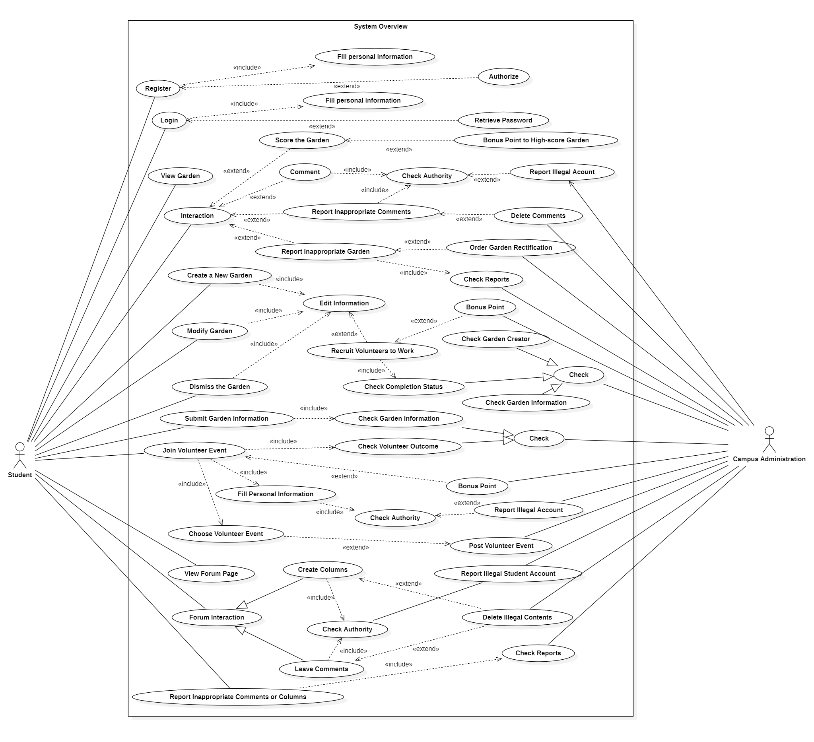

2. Login&Register System
   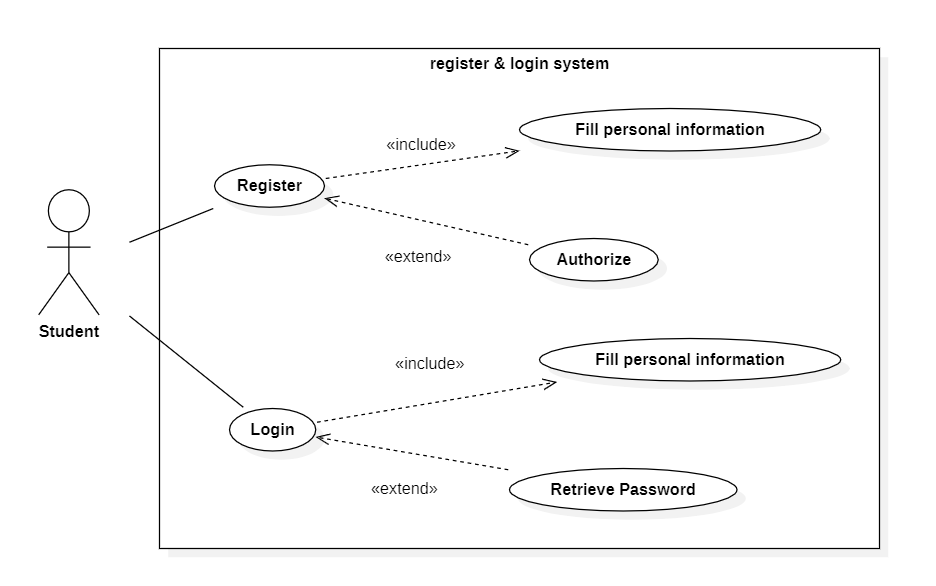
   
   | USE CASE         | REGISTER                                                     | LOGIN                                                        |
   | :--------------- | :----------------------------------------------------------- | :----------------------------------------------------------- |
   | Actor            | Student                                                      | Student                                                      |
   | Preconditions    | The user has accessed the registration page                  | The user has accessed the login page                         |
   | Postconditions   | The user successfully registers and is automatically redirected to the login page | The user successfully logs in and enters the system homepage |
   | Main Flow        | 1.The user enters their username, password, and other necessary information 2. The system verifies the user and input information 3. The user clicks the registration button 4. The user successfully registers | 1.The user enters their username and password 2. The system verifies the user information 3. The user successfully logs in and enters the system homepage |
   | Alternative Flow | 1. The input information is invalid, and the user is prompted to modify it 2. The username is already registered, and the user is prompted to re-enter the information | 1. The username or password is incorrect, and the user is prompted to re-enter the information 2. The user enters incorrect information multiple times, and the system locks the account |
   | Exception Flow   | 1. The user has not entered required fields, and is prompted to enter them 2. The user has entered an invalid email or phone number, and is prompted to re-enter | N/A                                                          |
   |                  |                                                              |                                                              |

3. Forum System
   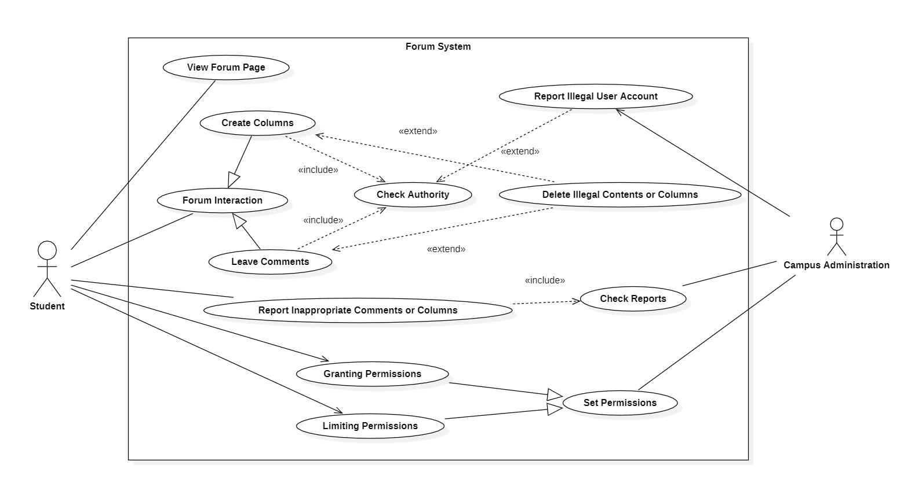
   
   | USE CASE         | View Forum Page                                                     |Forum Interaction                                                        |
   | :--------------- | :----------------------------------------------------------- | :----------------------------------------------------------- |
   | Actor            | Student                                                      | Student                                                      |
   | Preconditions    |The student has a valid account.|The student has a valid account and has successfully logged in to the forum interface|
   | Postconditions   | N/A|1. The student successfully leaves a message under their own or others' posts 2. The student successfully publishes their own post 3. The student successfully likes other posts or messages |
   | Main Flow        | 1. The student enters the main interface of the system and logs in 2. The student browses the forum 2.1. The student can scroll through the interface to browse the keywords of different posts 2.2. The student can select a post of interest and click to enter 2.3. The student can choose to block posts that are not of interest | 1. The student enters the message or post publishing box 1.1. The student enters the comment area of the post and clicks on the comment box 1.2. The student clicks on the plus sign in the upper right corner of the system interface to enter the post publishing box 2. The system checks the validity of the student's account, and if passed, the student can edit the content of the message or post 3. Click OK to publish the message or post 4. Like their own or others' messages or posts|
   | Alternative Flow | 1. The student enters the forum but finds no posts of interest and exits the forum directly 2. The student selects to switch accounts while browsing| 1. After entering the message or post publishing box, the student exits directly without publishing any content 2. After editing the content in the post or message publishing box, the student exits the publishing box directly without publishing the content, and the system will automatically save the draft 3. The student likes and then unlikes|
   | Exception Flow   | 1. The student selects to log in to the account repeatedly, and the system will prompt a failure 2. The student selects to pull down the interface after the content has been browsed, and the system will prompt that there is no more content|1. The student posts or comments too frequently in a short period of time, and the system will consider it as suspected spam and restrict the posting or commenting for a certain period of time 2. The student's post or comment has been successfully reported multiple times for illegal reasons, and their account will be locked and unable to post or comment normally 3. The student's post or comment has been successfully reported and deleted |   
   
     | USE CASE         | Report Inappropriate Comments or Posts   | Limit Permission |
   | :--------------- | :----------------------------------------------------------- | :----------------------------------------------------------- |
   | Actor            | Student                                                      | Campus Administration                                                 |
   | Preconditions    | The student has a valid account and has successfully logged in to the forum interface                  | Campus administration receives reports from students regarding posts or comments   |
   | Postconditions   |1. The student successfully reports illegal posts or comments, and the corresponding posts or comments are deleted 2. The student's report is unsuccessful 3. The user whose post or comment was reported has violated the rules multiple times, and their account has been temporarily blocked | The permission for students to post, comment, or report will be locked for a period of time|
   | Main Flow        | 1. The student views a post or comment and discovers that it contains inappropriate content 2. The student clicks "report" on the corresponding post or comment, fills in the reason for the report, and submits it 3. The system reviews the reported post or comment 3.1. If the post or comment violates forum rules, it will be deleted and the reporter will be notified 3.2. If the post or comment does not violate forum rules, it will be referred to the campus administration for review. If it is found to be in violation, it will be deleted; if not, nothing will happen 4. If the report is successful, the user whose post or comment was reported will have a record of their violation 5. If the user whose post or comment was reported has multiple violations, their account will be blocked for a period of time, during which they cannot post or comment  | 1. Campus administration receives reports from students regarding posts or comments 2. Campus administration checks the reported content 3. Implement corresponding permission restriction measures based on the truthfulness of the report 3.1. If the reported user has posted inappropriate content multiple times in a short period, their permission to post or comment will be locked for a period of time 3.2. If the reporter submits invalid or false reports multiple times, it will be considered as malicious reporting. In this case, the system will limit the user's reporting permission for a period of time 4. Notify the user of the restricted permission |
   | Alternative Flow | 1. If the student submits a report and wishes to retract it before it has been reviewed by the system or campus administration, they may do so 2. The student can check the progress of their report| 1. After restricting the user's relevant permission, it can be revoked depending on the situation 2. If the report is invalid and the reporter does not constitute malicious reporting, the campus administration will not limit the user's relevant permission|
   | Exception Flow   | 1. If the student clicks "report" without filling in the reason, the report will not be submitted 2. If the student submits multiple invalid reports within a short period of time, their reporting privileges will be restricted for a period of time| If the user is reported again during the period of restricted posting or commenting permission, the campus administration will not be able to restrict their permission again                                                      |

4. Maintainence System
   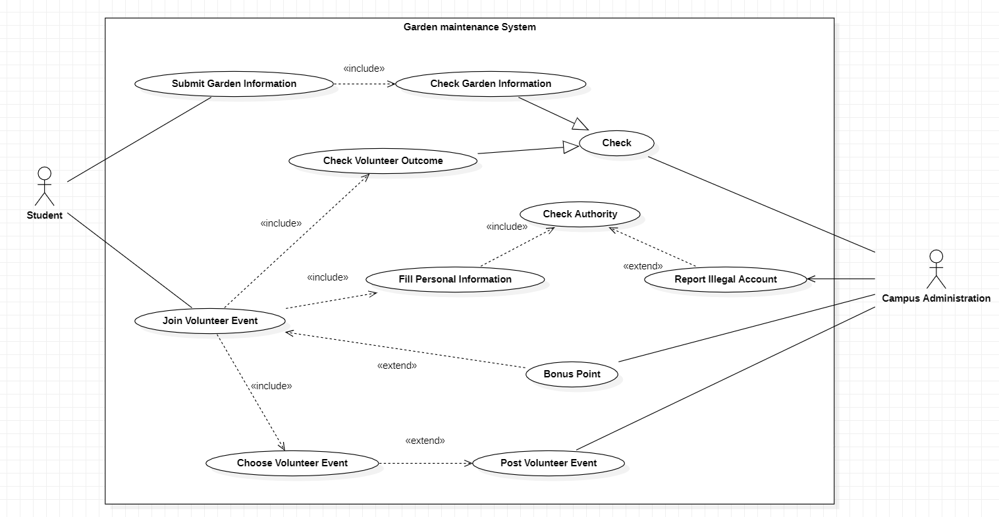

   | USE CASE         | Submit garden information                             | Join Volunteer Even                                                        |Recruit volunteer |
   | :--------------- | :----------------------------------------------------------- | :----------------------------------------------------------- | :----------------------------------------------------------- |
   | Actor            | Student                                                      | Student                                                      |campus administration|
   | Preconditions    | Students apply to submit information related to garden maintenance.           | Campus administration has published a volunteer recruitment information related to garden maintenance                     |The campus administration has decided to support the student's application as the submitted garden maintenance-related information is reasonable|
   | Postconditions   | The school publishes voluntary activities related to garden maintenance.| Successfully participate in volunteer events and obtain activity points|Volunteers who participate in the garden maintenance and upkeep activity receive corresponding activity points|
   | Main Flow        | 1. Students fill in the information related to the garden's current aging, deficiencies, or the need for additional flower pots and submit it 2. Campus administration checks the garden-related information submitted by the student 3. Campus administration publishes a volunteer recruitment activity for students to participate in garden maintenance based on the needs provided by the student 4. The user successfully registers | 1. Students browse volunteer recruitment information on the system interface and select volunteer activities of interest 2. Students fill in personal information and submit 3. The system automatically checks the student's personal information and permissions, that is, whether it is suitable for participating in volunteer activities 4. The system authorizes the student to become a member of the corresponding volunteer activity and participate in garden maintenance 5. Campus administration checks the volunteer service output of students participating in garden maintenance and rewards activity points according to their service output |1. The campus administration publishes volunteer recruitment information for the garden maintenance and upkeep activity 2. Students sign up for the volunteer activity and begin working 3. The campus administration checks the completion status of the volunteer's work and awards corresponding activity points to the volunteers |
   | Alternative Flow | Students do not submit immediately after filling out the relevant information, and the system automatically saves the draft |  After becoming a member of a volunteer activity, students apply to withdraw from the activity, and the system approves it |1. If the garden maintenance and upkeep workload is small and the applicant is willing to complete the work on their own, the campus administration does not need to recruit additional volunteers 2. If an applicant withdraws their garden maintenance and upkeep application midway, the campus administration can abandon the volunteer recruitment information |
   | Exception Flow   | Campus administration finds that the garden-related information submitted by the student is untrue and does not release relevant volunteer recruitment information | 1. Students participate in volunteer activities but refuse to work, which has no effect on garden maintenance. Campus administration will not award points and record one misconduct 2. After students fill in personal information, the system finds that they have short-term past bad records and will not authorize them to participate in volunteer activities                        |1. If volunteer information is published but there are not enough people willing to serve as volunteers, the garden maintenance and upkeep plan may fail 2. If the volunteers handle the work improperly, the garden maintenance and upkeep plan may also fail    |       

5. Visit System
   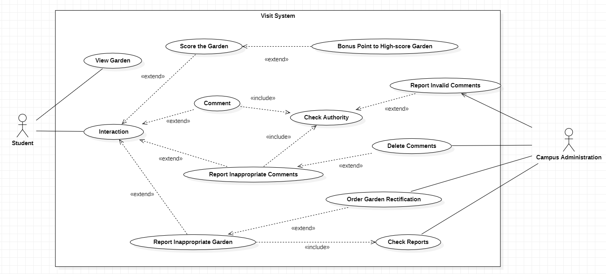
   
      | USE CASE         |Score and Comment the Garden          |Report inappropriate Comments or Garden                              |
   | :--------------- | :----------------------------------------------------------- | :----------------------------------------------------------- |
   | Actor            | Student                                                      | Student                                                      |
   | Preconditions    | Students enter the garden access system and browse the relevant information of various gardens      |Students enter the garden access system and browse the relevant information of various gardens and their comment areas                |
   | Postconditions   | Students successfully score or leave comments on the garden| 1. Inappropriate comments are deleted 2. Inappropriate garden configurations are rectified |
   | Main Flow        | 1. Students click on the garden they are interested in and view its related display information 2. Students score or leave comments 2.1. Students score, and if the total score of the corresponding garden is high enough, the main contributors to the garden's past creation and maintenance will be rewarded with a certain amount of activity points 2.2. Students leave comments, and the system checks the user's permission to decide whether to allow the comment | 1. Students click on the homepage of the garden they are interested in and view its information and comment area 2. Identify inappropriate garden configurations or comments, and fill out a report 3. The system or campus administration handles the report 3.1. If inappropriate comments are reported, the system first checks whether the comments violate the rules. If they do, the comments are automatically deleted. If not, the report is forwarded to the campus administration for review and decision-making 3.2. If inappropriate garden configurations are reported, the relevant report information is sent directly to the campus administration. Once the information is verified, the administration will issue an order to rectify the inappropriate configurations  |
   | Alternative Flow | Students simply browse garden information without scoring or commenting| 1. Students can choose to withdraw the report while the report information is being processed 2. Students can view the review progress of the report information|
   | Exception Flow   | 1. Students enter an invalid score (exceeding the upper and lower limits), and the system prompts an error 2. Students have a large number of recent misconduct records (such as multiple successful reports of their comments), and the system disables their permission to leave comments| Students make multiple invalid and groundless reports in a short period, and the system will restrict their report permission for a certain period                  |

6. Create&Modify System

   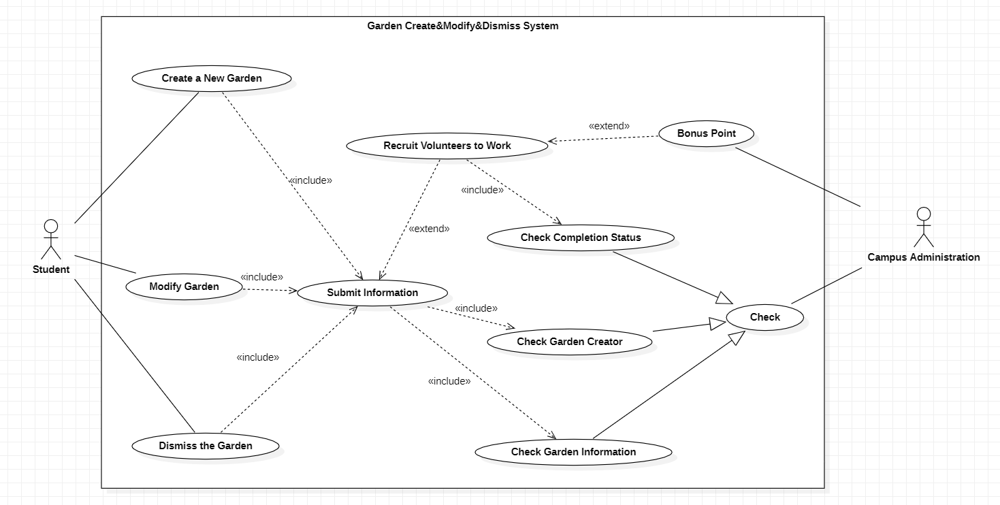
   | USE CASE         | Create or Modify or Remove a Garden               | Check Completion Status                                                        |
   | :--------------- | :----------------------------------------------------------- | :----------------------------------------------------------- |
   | Actor            | Student                                                      | campus administration                                 |
   | Preconditions    | The student applies to create, modify, or remove a garden           | The student's garden creation/modification/removal request is reasonable, and the campus administration has decided to support the student's application                      |
   | Postconditions   | The garden is successfully created, modified, or removed | Volunteers who participated in the garden creation/modification/removal activities received corresponding activity points rewards |
   | Main Flow        | 1. The student enters the garden creation, modification, or removal page, fills in and submits the reasons and relevant information 2. The campus administration reviews the applicant's personal information and garden-related information 3. If the review is passed, the campus administration publishes a volunteer recruitment information to create, modify, or remove the garden  | 1. The campus administration publishes a volunteer recruitment information for the creation/modification/removal of gardens 2. The student signs up for the volunteer activity and starts working 3. The campus administration checks the completion status of the volunteers and awards them corresponding activity points accordingly |
   | Alternative Flow | 1. After submitting the application information, the student can withdraw the application before the campus administration executes it 2. If the garden information submitted by the student and the reasons for creating, modifying, or removing the garden are not sufficient, the campus administration will reject the student's application and will not publish the volunteer recruitment information | 1. If the garden creation/modification/removal workload is not large and the applicant is willing to do it on their own, the campus administration does not need to recruit additional volunteers 2. If the applicant withdraws the garden creation/modification/removal application in the middle, the campus administration abandons the recruitment information |
   | Exception Flow   | 1. If the volunteer information is published, but not enough people are willing to come and be volunteers, the garden creation, modification, or removal plan may fail 2. If the volunteer's operation is improper, the garden creation, modification, or removal plan may fail| 1. If the volunteer information is published, but not enough people are willing to come and be volunteers, the garden creation, modification, or removal plan may fail 2.  If the volunteer's operation is improper, the garden creation/modification/removal plan may fail     |

### 3.4 Activity Diagrams
1. Register

  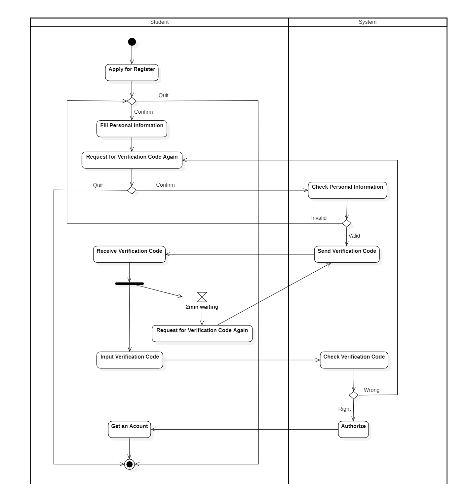

  Students submit registration applications, fill in personal information, and submit them. Then, the application sends a verification code. The system checks the personal information filled in by the applicant. If it is illegal, the system requires the applicant to fill in the information again. If it is legal, the system sends a verification code. After receiving the verification code, the applicant enters it immediately. The system checks the verification code. If it is verified successfully, the system authorizes the applicant, and the applicant officially obtains an account. If the verification fails, the user is asked to reapply for the verification code. Note that each verification code sent by the system will expire after 2 minutes. The user must enter the verification code during this period, otherwise, the user must reapply for the verification code. Users can abandon the registration application at any time while filling in personal information or waiting for verification.

2. Login

  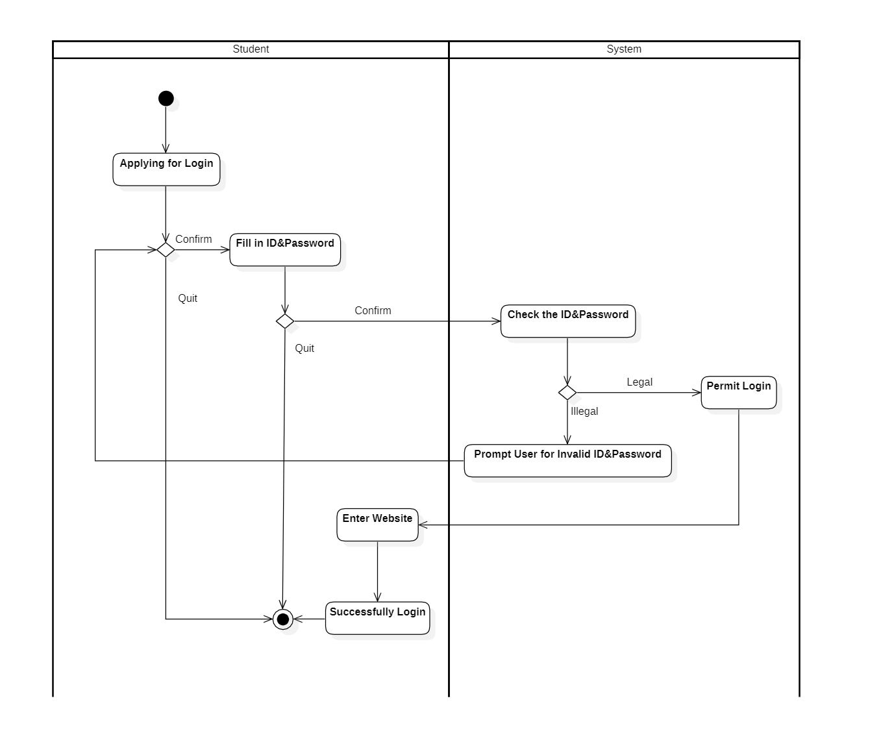

  Students enter the login interface, click to login, fill in the account ID and password, and the system checks the ID and password. If it is illegal, the system requires the user to fill in the information again. If it is legal, the user is allowed to log in, and the user enters the system main interface and successfully logs in. While filling in the ID and password, users can choose to abandon the login at any time.

3. Comments in Forum

  

  Students click to enter the forum comment box, and the system checks the user's comment permission. If it does not pass, the user is refused to post a comment. If it passes, the user is allowed to post a comment. After the user posts a comment, the system will also check the content of the comment. If it violates the rules, the comment will be deleted. Otherwise, the comment is successfully published.

4. Score the Garden

  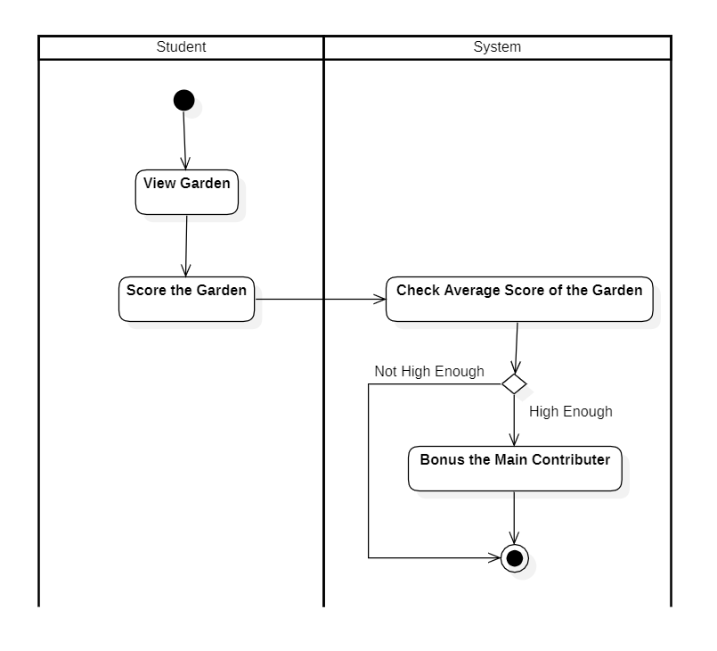

  Students enter the garden access interface, browse the information of various gardens, and score the gardens. After scoring, the system will check the average score of the garden. If it is high enough, the system will give corresponding activity points to the main contributors of the garden.

5. Report Inappropriate Comments

  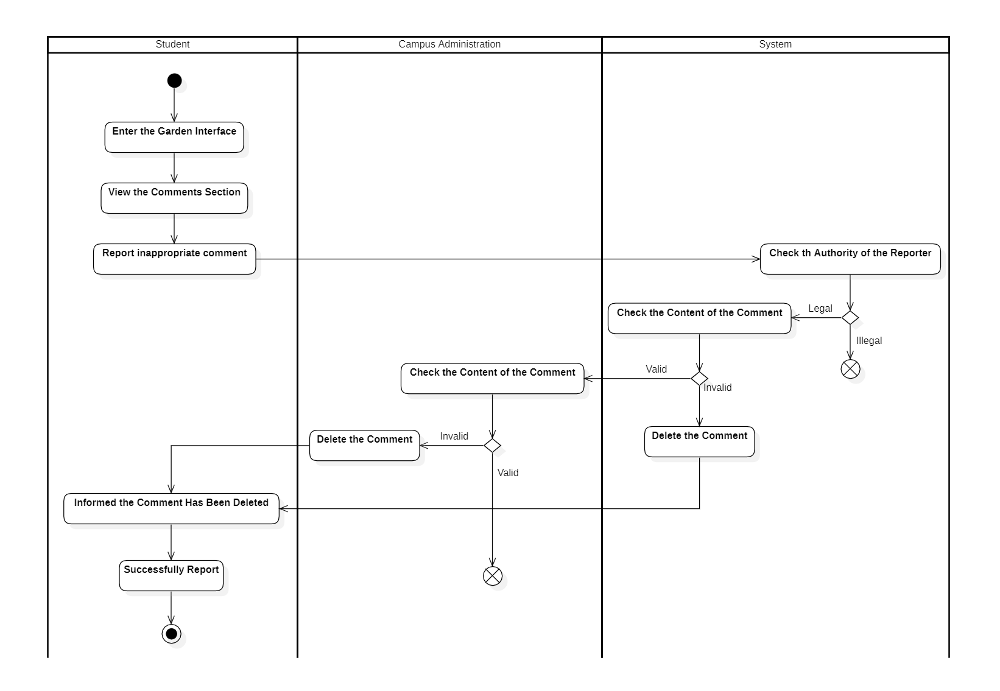

  Students enter the garden access interface or the comment area of the forum and browse the content of the comment area. If they find any inappropriate comments and report them, the system will first check the reporting user's reporting permission. If it passes, the system will check whether the comment content violates the rules. If it violates the rules, the comment will be deleted. If it does not violate the rules, the comment will be handed over to the campus administration for review. If the campus administration finds the comment content to be inappropriate, the comment will be deleted. If it is not inappropriate, the comment content will be preserved. Once the comment content is deleted, the reporter will be informed that the report was successful.

6. Create a New Garden

  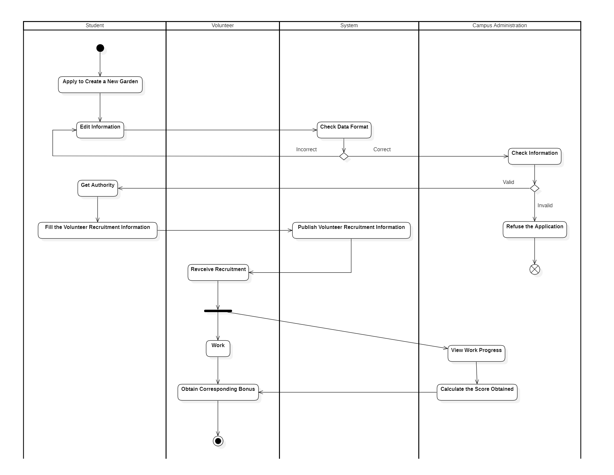

  Students enter the system interface, click to apply to create a new garden, and fill in garden information. The system checks the data format of the filled-in information. If it is not standardized, the applicant is required to fill in the information again. If it is standardized, the campus administration reviews the information for creating a new garden. If the campus administration finds the information to be unreasonable, the application will be rejected. If it is considered reasonable, the campus administration authorizes the applicant to fill in volunteer recruitment information and the system publishes the information to recruit volunteers to participate in creating a new shared garden. The campus administration also checks the completion status of the volunteer applicants and calculates the activity points based on their work effectiveness, which are rewarded to the volunteers.

## 4. Supplementary Specification

This section describes the functional and non-functional requirements that are not captured by the use case model. It also specifies the design constraints and assumptions that affect the system development. The supplementary specification complements the use case model by providing additional details and clarifications for the system requirements.

### 4.1 Functional Requirements

This section lists the functional requirements that describe the system behavior and functionality. The functional requirements are derived from the use cases and the project scope. They are categorized by the main features of the system.

#### 4.1.1 Shared Garden Toolkit

- The system shall provide a web-based interface for students to design and build their own shared gardens on campus.
- The system shall allow students to select a location, size, shape, and layout for their - shared gardens.
- The system shall provide a database of plants and flowers that students can choose from to populate their shared gardens.
- The system shall provide information and guidance on how to plant and care for the plants and flowers in the shared gardens.
- The system shall allow students to save, edit, and share their shared garden designs with other students and the campus administration.
- The system shall calculate and display the environmental benefits of each shared garden, such as carbon dioxide reduction, oxygen production, and water conservation.
- The system shall award credits and rewards to students based on their participation and contribution to the shared garden project.

#### 4.1.2 Shared Garden Community

- The system shall provide a web-based platform for students to communicate and collaborate with other students who are involved in the shared garden project.
- The system shall allow students to create and join groups based on their interests, preferences, and goals related to the shared garden project.
- The system shall allow students to post messages, photos, videos, and feedback on their shared gardens and other shared gardens on campus.
- The system shall allow students to rate and review other shared gardens on campus based on various criteria, such as aesthetics, diversity, sustainability, and creativity.
- The system shall provide a leaderboard that ranks the shared gardens on campus based on their ratings, reviews, and environmental benefits.

### 4.2 Non-Functional Requirements

This section lists the non-functional requirements that describe the system quality and performance. The non-functional requirements are derived from the project scope and the stakeholder expectations. They are categorized by the main attributes of the system.

#### 4.2.1 Usability

- The system shall provide a user-friendly and intuitive interface that is easy to navigate and operate.
- The system shall provide clear and consistent instructions, labels, and feedback to the users.
- The system shall provide help and documentation features that explain the system functionality and usage.
- The system shall support multiple languages, including English and Chinese.

#### 4.2.2 Reliability

- The system shall ensure the accuracy and completeness of the data stored and displayed.
- The system shall prevent unauthorized access and modification of the data.
- The system shall handle errors and exceptions gracefully and provide appropriate error messages to the users.
- The system shall recover from failures and resume normal operation as soon as possible.

#### 4.2.3 Efficiency

- The system shall respond to user requests within a reasonable time frame.
- The system shall optimize the use of network bandwidth and server resources.
- The system shall support concurrent access by multiple users without compromising the system performance or functionality.

#### 4.2.4 Maintainability

- The system shall be modular and well-documented to facilitate future changes and enhancements.
- The system shall follow coding standards and best practices to ensure the readability and consistency of the code.
- The system shall use open-source technologies and frameworks to reduce the dependency on proprietary software.

### 4.3 Design Constraints and Assumptions

This section describes the design constraints and assumptions that affect the system development and operation.

- The system supports cross-platform deployment, including client-side, web-based, mobile, and WeChat mini-program applications. The system should be compatible with different operating systems, browsers, and devices.
- The system uses Oracle as the database technology for storing and retrieving the data of the system. The system should comply with the Oracle database standards and specifications.
- The system uses HTML, CSS, JavaScript, and Vue as the front-end technologies for developing the user interface of the system. The system should follow the best practices and guidelines of web development and design.

## 5. List of References

This section lists some of the references that can be used for further information and guidance on the software requirements specification.

[1] Built In. (2022). What Is a Software Requirement Specification? Retrieved from https://builtin.com/software-engineering-perspectives/software-requirement-specification

This article provides an overview of what a software requirement specification is, why it is important, and what it should include. It also gives some tips and best practices for writing an effective SRS document.

[2] Enou. (2022). Best Guide on Software Requirements Specification 2023. Retrieved from https://enou.co/blog/software-requirements-specification/

This guide explains the purpose, benefits, and challenges of software requirements specification. It also provides a detailed outline of the SRS document structure and content, as well as some examples and templates.

[3] Perforce. (n.d.). How to Write a Software Requirements Specification (SRS). Retrieved from https://www.perforce.com/blog/alm/how-write-software-requirements-specification-srs-document

This blog post describes how to write a software requirements specification document that meets the needs of all stakeholders. It also covers the key elements and characteristics of an SRS document, as well as some common mistakes to avoid.

[4] Asana. (n.d.). How to write a software requirement document (with template). Retrieved from https://asana.com/resources/software-requirement-document-template

This resource offers a step-by-step guide on how to write a software requirement document that captures the scope, goals, and functionality of the project. It also provides a free template that can be customized and used for any software project.

## 6.Contributions

This project is the result of multiple discussions, revisions, additions, and refinements by two team members. Both members actively participated in the project and took on tasks in each section. We collaborated effectively and contributed to the quality and completeness of the project. The division of labor within the group was average and clear, as follows:

|Student Number|Name|Score Weight|
|---|---|---|
|2050633|Jialin Lu|100%|
|2053711|Jie Chu|100%|