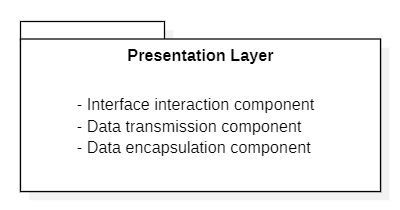
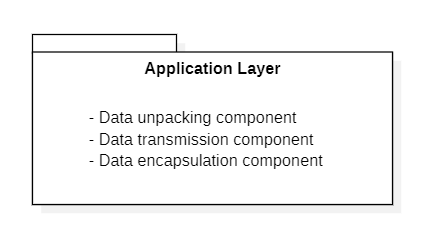
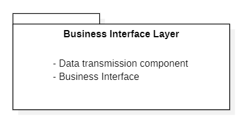
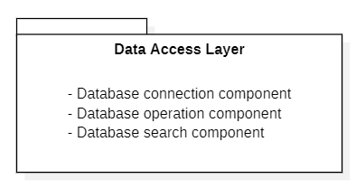
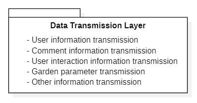

Content
 
[toc]

## 1.Introduction

### 1.1 Purpose

The Sharing Garden project is an initiative that responds to the national call for energy conservation and emission reduction, aiming to build a green and low-carbon campus. It actively promotes the development of a scientific, low-carbon, and efficient resource allocation model to adapt to the evolving landscape of higher education and contribute to ecological civilization. The main action of this project is to transform idle and abandoned land on the campus into shared gardens, designed and built by all students. The project aims to achieve the goal of participatory landscape design, where students can earn credits and rewards, such as potted plants, through their involvement. We will establish a web-based application that includes a toolkit for constructing shared gardens and a community platform for shared garden enthusiasts.

Furthermore, the purpose of this document is to provide a comprehensive and detailed description, outlining the requirements and specifications for a web-based application that supports students in creating and sharing campus garden projects. The web-based application aims to achieve the following objectives:

- Enhance students' learning experience and engagement in environmental education and sustainable development themes by enabling them to design, create, and share their own campus gardens.
- Foster students' creativity and collaboration skills by allowing them to explore and visit other campus gardens.
- Cultivate students' awareness and appreciation of the campus environment and biodiversity.
- Facilitate campus management departments in managing and assessing campus facilities and resources by providing data and feedback on campus gardens.

共享花园项目是响应国家节能减排号召的倡议，旨在建设绿色低碳校园。它积极促进科学、低碳、高效的资源配置模式的发展，以适应高等教育的发展形势，并推动生态文明建设。该项目的主要行动是将校园内的闲置废弃土地改造成共享花园，由所有学生参与设计和建造。这个项目旨在实现参与式景观设计的目标，学生可以通过参与获得积分和奖励，如花卉盆栽。我们将建立一个基于 WEB 的应用程序，其中包括建造共享花园的工具包和共享花园社区。

同时，本文档的目的是提供一个详细而全面的描述，说明支持学生创建和分享校园花园项目的基于WEB的应用程序的需求和规范。基于WEB的应用程序旨在实现以下目标：

- 通过让学生设计、创建和与其他学生分享自己的校园花园，提高学生在环境教育和可持续发展主题方面的学习体验和参与度。
- 通过让学生探索和参观其他校园花园，培养学生的创造力和协作能力。
- 通过让学生了解和欣赏校园环境和生物多样性，提高学生的意识和赞赏。
- 通过为校园管理部门提供有关校园花园的数据和反馈，方便校园管理部门对校园设施和资源的管理和评估。

### 1.2 Progress and Current Status

In the first document, we have already provided readers with a detailed description of the functionalities of Sharing Garden project, and this document covers the progress of analysis model and architectural analysis.

In order to gain a comprehensive understanding of the system and its functionalities, we conducted a System Detailed Analysis. Based on the analysis, we designed a System Hierarchical Architecture that clearly defines 5 subsystems within the system:

- Login & Register System
- Forum   
- Garden Update 
- Garden View   
- Report

 For each subsystem, we created robustness diagrams, class diagrams, and sequence diagrams to illustrate their interactions and behaviors. Furthermore, we updated the existing use case models to enhance their simplicity and clarity.

在第一篇文档中，我们已经为读者提供了共享花园项目功能的详细描述，这篇文档涵盖了分析模型和架构分析的进展。

为了全面了解系统及其功能，我们进行了系统细节分析。根据该分析，我们设计了系统整体架构图，明确定义了系统内的五个子系统。对于每个子系统，我们创建了鲁棒图、类图和时序图，以展示其交互和行为。此外，我们还更新了现有的用例模型，以增强其简洁性和清晰性。

### 1.3 Changes in the System 

Throughout the system analysis process, we have identified several areas where enhancements and optimizations can be made:

- Simplifying the user experience by implementing intuitive and user-friendly interfaces, ensuring that users can easily navigate and interact with the Shared Garden platform.
- Refining the system's architecture by categorizing classes into three distinct parts: boundary classes, control classes, and entity classes. This clear separation improves the system's clarity, maintainability, and security.
- Making necessary modifications to the use case diagram to accurately reflect the updated system components and user interactions.

These changes aim to streamline the user experience, enhance system reliability, and provide a comprehensive platform for garden enthusiasts. By addressing these areas of improvement, we strive to create a system that not only meets the immediate needs of users but also allows for future scalability and adaptability.

在系统分析的过程中，我们确定了几个需要进行改进和优化的方面：

- 通过实现直观和用户友好的界面，简化用户体验，确保用户可以轻松地浏览和与共享花园平台进行交互。
- 通过将类别划分为边界类、控制类和实体类，优化系统的架构。这种明确的划分提高了系统的清晰度、可维护性和安全性。
- 对用例图进行必要的修改，准确反映更新后的系统组件和用户交互。

这些变更旨在简化用户体验、提高系统可靠性，并为花园爱好者提供一个全面的平台。通过解决这些改进方面，我们努力创建一个不仅满足用户当前需求，而且具有未来可扩展性和适应性的系统。

## 2. Architecture Decisions

The "Sharing Garden" project is a web-based application that aims to facilitate the creation and sharing of campus gardens among students. To develop an effective and user-friendly platform, it is crucial to conduct a thorough system analysis and design the architecture accordingly. Our analysis includes a System Detailed Analysis, Hierarchical Architecture Design, and Robustness Diagrams. The key considerations for our architecture design are providing extensive and comprehensive functionality, ensuring the security and privacy of user information, and optimizing platform performance and availability for developers.

“共享花园”项目是一个基于网络的应用程序，旨在促进学生之间创建和共享校园花园。为了开发一个有效且用户友好的平台，我们需要进行全面的系统分析，并相应地设计架构。我们的分析包括系统细节分析、分层架构设计和鲁棒图。我们的架构设计主要考虑提供全面且丰富的功能、确保用户信息的安全和隐私，并为开发人员优化平台性能和可用性。

### 2.1 System Detailed Analysis

During the requirements phase, we extensively studied the interactions between various system components and external entities. We also conducted a preliminary analysis of the system using use cases. In the early stages of architecture design, we focused on defining the specific behavioral steps required to fulfill each use case. Subsequently, we broke down the system into smaller subsystems based on their functionalities and transformed the use cases into robust graphical representations.

The system can be classified into several subsystems based on their specific functions, including the login and registration system, garden activity management system, garden club management system, member management system, forum system, and personal information maintenance system. Building upon this classification, we established a hierarchical structure for the system, taking into account responsibilities and generalizability, to further divide it into subsystems.

在需求阶段，我们广泛地研究了各种系统组件和外部实体之间的交互。我们还使用用例对系统进行了初步分析。在架构设计的早期阶段，我们专注于定义实现每个用例所需的特定行为步骤。随后，我们根据功能将系统分解为更小的子系统，并将用例转换为健壮的图形表示。

本系统根据其具体功能可分为登录注册系统、园林活动管理系统、园林俱乐部管理系统、会员管理系统、论坛系统、个人信息维护系统等几个子系统。在这个分类的基础上，我们为系统建立了一个层次结构，考虑到责任和可泛化性，进一步将其划分为子系统。

### 2.2 Hierarchical Architecture Design

This system is mainly divided into presentation layer, application layer, business interface layer, business logic layer, data access layer, and communication layer. There is data communication and module invocation between each layer. The overall architecture diagram is shown below.

本系统主要分为表现层、应用层、业务接口层、业务逻辑层、数据访问层和 通信层，各个层之间有数据通信和模块的调用，以下为整体架构图

#### 2.2.1 The presentation layer

The presentation layer is primarily responsible for interacting with users and encapsulating user interaction data to be processed by subsequent layers. It also displays different interfaces based on feedback from the business layer.

- Interface Interaction Component: This component is responsible for presenting different pages to users, facilitating user input. 
- Data Encapsulation Component: It encapsulates and encrypts the data entered by the user. 
- Data Transmission Component: It transmits the user's input data to the business layer for processing.

表现层主要负责和用户的交互，并将用户的交互数据封装后传给后续进行 处理;同时其根据来自业务层的反馈信息，展示不同的界面。 

- 界面交互(Interface Interaction Component):其主要负责展现给用 户不同的页面，便于用户的输入。 

- 数据封装(Data Encapsulation Component):将用户输入的数据进行封 装加密。 
- 数据传送(Data Transmission Component):将用户输入的数据传送给 业务层进行处理。

#### 2.2.2 The application layer

The application layer is one of the core layers of the system, serving as a bridge to coordinate the scheduling and interaction of data between the presentation layer and the business logic layer. During the operation of the system, the application layer receives user requests from the presentation layer and forwards them to the corresponding business logic layer for processing. It is also responsible for transmitting the results returned by the business logic layer to the presentation layer for displaying the processing results to the user.

应用层是系统的核心层之一，它起着桥梁的作用，负责协调数据在表现层和业务逻辑层之间的调度和交互。在系统运行过程中，应用层接收来自表现层的用户请求，并将请求转发给相应的业务逻辑层进行处理。它还负责将业务逻辑层返回的结果传递给表现层，以便将处理结果展示给用户。

#### 2.2.3 The business interface layer

The business interface layer is a vital component of the system, responsible for presenting the functionalities of the business logic layer to the outside. It serves as a link between the presentation layer and the business logic layer, receiving data from the presentation layer and passing it to the business interface layer. Depending on the situation, the business interface layer calls different modules from the business logic layer to perform operations.

- Data Transmission Component: Transfers data from the presentation layer to the business logic layer and sends data from the business logic layer to the presentation layer. 
- Business Interface: An interface used to invoke different business operations within the business logic layer.

业务接口层是系统中的一个重要组成部分，主要负责将业务逻辑层的功能对外展示。它充当着表现层与业务逻辑层之间的纽带，接收来自表现层的数据并将其传递给业务接口层。根据不同的情况，业务接口层会调用业务逻辑层中的不同模块来进行操作。

- 数据传送组件：负责将来自表现层的数据传送给业务逻辑层，并将来自业务逻辑层的数据发送给表现层。 
- 业务接口：用于调用业务逻辑层中不同业务操作的接口。

#### 2.2.4 The business Implementation  layer

The business implementation layer is the core of the overall architecture, playing a crucial role. It is responsible for implementing various business subsystems and transmitting the corresponding processed data to the presentation layer or data access layer.

业务逻辑层是整体架构的核心，承担着关键的角色。它负责实现各个业务子系统，并将相应的处理数据传输给表现层或数据访问层。

- Data Transmission Component: Receives data from the data access layer and sends it to the business interface layer. 
- Business Implementation: Handles the implementation logic of different business modules, processes various business requirements, and provides feedback on the processed results or requests to the data transmission module.

- 数据传送组件：接收来自数据访问层的数据，并将这些数据发送给业务接口层。 
- 业务实现：负责不同业务模块的具体实现逻辑，处理各类业务需求，并将处理后的结果或请求反馈给数据传送模块。

#### 2.2.5 The data access layer

The data access layer is a crucial component in the system architecture, responsible for interacting with and accessing the database. It performs different database operations based on the varying data requirements from the business layer.

数据访问层是系统架构中的一个关键组成部分，主要负责与数据库进行交互和访问。根据业务层对数据的不同要求，数据访问层执行相应的数据库操作。

#### 2.2.6 The data transmission layer

The data transmission layer is a critical component responsible for the transfer of information and signals between the main architectural layers of the system.

数据传输层是系统主要架构层之间信息和信号传输的关键组成部分。它承担着将数据在各个主要架构层之间进行传输的任务。

### 2.3 Robustness Diagrams

Through the use of robustness diagrams, we can provide a visual representation of the internal structure of each module and the interactions between them. This helps us gain a better understanding of the module's functionality and requirements, laying a foundation for model design. This analysis and design process enables us to better meet the system's functional requirements and ensure its stability and reliability in practical operation.

通过绘制鲁棒图，我们能够清晰地展示每个模块内部的结构和模块之间的交互关系。这有助于我们更好地理解模块的功能和需求，并为模型设计提供基础。这样的分析和设计过程使我们能够更好地满足系统的功能需求，并确保系统在实际运行中的稳定性和可靠性。

#### 2.3.1 Login & Register System

#### 2.3.2 Forum System

#### 2.3.3 Garden Update System

#### 2.3.4 Garden View System

#### 2.3.5 Report System

## 3. Analysis Model

### 3.1 Login & Register System

#### 3.1.1 Class Diagram

#### 3.1.2 Interaction Diagram

The following sequence diagram illustrates the system's processing flow during user login. On the login page, users can enter relevant information and click on "Login." The system will check if the password is correct, leading to either a page transition for the user or an error message indicating an incorrect password. On the registration page, users are required to create an account. The system will check if the account already exists. If it does not exist, a new account will be created for the user and saved in the database.

下面的时序图展示了用户登陆时系统的处理过程。在登陆页面，用户可以输入相关信息后点击登陆，系统会检查密码是否正确，从而让用户的界面跳转或提示密码错误。注册页面则需要用户创建账号，系统会检查账号是否已存在，若不存在则为其创建新账号并保存在数据库中。

### 3.2 Forum System

#### 3.2.1 Class Diagram

#### 3.2.2 Interaction Diagram

The following sequence diagram illustrates the system's processing flow when a user browses the forum's homepage. Users can click on a page to view detailed content, and the system retrieves the relevant content from the database for display. Users can navigate through the available content on the homepage by clicking on the "Next Page" or "Previous Page" buttons. The system will determine if there is a next or previous page and either display the content of that page or notify the user that the page does not exist.

下面的时序图展示了用户浏览论坛首页时系统的处理过程。用户可以点进展示详细内容的页面，系统从数据库中取出相关内容进行展示。用户可以点击下一页、上一页来翻阅首页存在的内容，系统会判断是否还存在下一页或上一页，从而选择展示这一页的内容或提示用户该页不存在。

The following sequence diagram illustrates the interaction process between a user and the system when browsing the comment section of a forum. Users can add comments, reply to comments, delete comments, or like comments. The system will assess the user's permissions and provide feedback accordingly. It will also make modifications to the database as necessary.

这张时序图则展现了用户浏览论坛评论区时与系统的交互过程。用户可以添加评论，回复评论，删除评论或点赞评论。系统会判断用户权限并给予反馈和进行数据库的修改。

### 3.3 Garden Update System

#### 3.3.1 Class Diagram

#### 3.3.2 Interaction Diagram

The following sequence diagram illustrates the scenario where a user requests to modify a garden. When the user clicks on the "Apply" button, the modification request is submitted for backend review. If the review is approved, the system notifies the user of the successful modification and displays the specific details of the garden before and after the modification. It also provides a detailed display of the modified areas. If the review is not approved, the system informs the user that their application has been rejected.

下面的时序图展示的情况是用户请求修改花园。用户点击申请后，申请会递交后端审核。若审核通过，则系统提示修改成功并向用户展示修改前后的花园具体信息、详细展示了修改的地方。若审核未通过，则需要提升用户申请失败。

The following sequence diagram illustrates the scenario where a system administrator reviews user requests. The administrator can first click on "View Details," and the system will display the specific details of the garden before and after the modification, including the modified areas. If the administrator clicks on "Approve," the system will mark the request as approved. If the administrator clicks on "Reject," the system will mark the request as rejected.

这张时序图说明的情况是系统管理员审核用户发送的请求。管理员可以首先点击查看详细信息，系统会展示修改前后的具体情况和修改的部位。如果管理员点击通过，则系统将该申请记录为已通过；如果点击拒绝，则系统将该申请记录为已拒绝。

The following sequence diagram illustrates the system processing flow for a user applying to become a volunteer. The user can first click on "Fill in the relevant information," and the system will store this information in the database. Then, the user can click on the "Join as Volunteer" button to submit an application to the administrator. If the application is approved, the user will receive a system notification indicating the successful application and detailed feedback. If the application is not approved, the user will receive a system notification indicating the unsuccessful application and providing specific reasons.

这张时序图展现了用户申请成为志愿者的系统处理过程。用户可以先点击填写相关信息，并由系统存储在数据库中。接着，用户可以点击加入志愿者按钮，向管理员递交申请。如果通过，则用户收到系统的申请成功提示和反馈的详细说明信息；如果未通过，则用户收到系统的申请失败提示和具体原因。

The following sequence diagram illustrates how an administrator reviews a user's volunteer application. The administrator can click on "View Application Details" to see the detailed information of the application and choose to either accept or reject it.

这张时序图则展示了管理员如何审核用户的志愿者申请。与审核花园修改请求类似，管理员可以点击查看申请的详细信息，并选择接受或拒绝申请。

### 3.4 Garden View System

#### 3.4.1 Class Diagram

#### 3.4.2 Interaction Diagram

The following sequence diagram illustrates how a user can view detailed information about a garden. The user can click on a garden of interest, and the system will retrieve and display specific details about that garden. The user can interact with the interface by liking, rating, and leaving comments. The system will record these actions. Comments will undergo backend review, and if approved, the user can see the published comments. If not approved, the user will receive a notification.

这张时序图展现了用户如何查看花园详细信息。用户可以点击感兴趣的花园，系统会返回该花园的具体情况。用户可以在界面中点赞、评分和留下评论，系统会记录这些操作。其中评论会交由后端审核，若通过则用户可以看见发布的评论，若未通过用户也会收到提示。

### 3.5 Report System

#### 3.5.1 Class Diagram

#### 3.5.2 Interaction Diagram

The following sequence diagram illustrates the process of a user reporting inappropriate content. The user clicks on the "Report" button, and the system sends the relevant content to undergo backend review. Once the review is complete, the system provides a notification on the interface to inform the user of the review outcome. The user also has the option to cancel the report.

这张时序图展现了用户举报不良内容的过程。用户点击举报按钮，系统会把相关内容送往后端审核，审核结果会在审核结束后返回界面提示用户。用户也可以选择取消举报。

The following sequence diagram illustrates the process of an administrator reviewing reported content. The administrator can view the detailed information of the report and choose to either approve or reject the report.

下面的时序图展现了管理员审核举报的过程。管理员可以查看举报详细内容，并选择通过或拒绝举报。

Additionally, the system supports the administrator's ability to directly delete content. The administrator can click on the delete button to remove inappropriate content directly, and they also have the option to cancel the deletion operation.

此外，系统还支持管理员直接对内容进行删除的操作。管理员可以通过点击删除按钮直接删除不良内容，也可以取消删除操作。

## 4. Updated Use Case Model

We originally had five major systems, namely the Login&Register System, Forum System, Garden Maintenance System, Visit System, and Garden Create&Modify&Dismiss System. The Login&Register System remains unchanged, while the other systems undergo certain modifications, including but not limited to:

- The Garden Maintenance System and Garden Create&Modify&Dismiss System are merged into a single system called the Garden Update System.
- The authentication function is removed from all systems, as users who can log in to the system have already completed the identity verification process.
- The Visit System is renamed as the Garden View System, and the reporting functionality for inappropriate content is removed from all systems. Instead, a new Report System is created specifically for students to report incidents to the campus administrators.
- Newly added report system is as the following image shows:

我们原本有5大系统，分别是Login&Register System, Forum System, Garden Maintenance System, Visit System, Garden Create&Modify&Dismiss System。现Login&Register System维持不变，其他系统做一定删改，包括但不限于：

- 将Garden Maintenance System和Garden Create&Modify&Dismiss System融合成一个Garden Update System

- 删去所有系统中的身份验证功能，因为能登入系统的用户已经完成了身份信息的验证

- 将Visit System更名为Garden View System，将所有系统中的不良内容举报功能删去，融合成一个Report System，专门用于学生向校园管理员举报。

### 4.1 Forum System

The forum system is modified as follows:

- The authentication function has been removed because users who can log into the system are assumed to have already been verified. 
- The reporting functionality for inappropriate content has been removed as there is an additional Report System to handle this task. 
- Due to the absence of authentication and content reporting features, campus administrators are no longer involved as users in this system. 
- The "View Forum Page" feature has been further specialized into "View Column," "View Columns," and "View Comments."

论坛系统做出了以下修改：

- 删去了身份验证的功能，因为默认能登入系统的用户身份都已经得到了验证。
- 删去举报不良内容的功能，因为有额外的Report System系统能做这件事。
- 因为没有了身份验证和不良内容举报功能，故而校园管理员的用户身份即不参与本系统。
- 将View Forum Page功能再特化为View Column和View Columns和View Comments

### 4.2 Garden Update System

The garden update system is modified as follows:

- This system combines the original Garden Maintenance System and Garden Create&Modify&Dismiss System, merging the four functions of Maintenance, Create, Modify, and Dismiss into a single feature called Garden Update Apply.

- This system inherits the functionality of the original two systems, which include campus administrators publishing volunteer recruitment information, rewarding volunteers, and allowing students to participate in volunteer activities.

花园更新系统做出了以下修改：

- 本系统是将原系统的Garden Maintenance System和Garden Create&Modify&Dismiss System融合到了一起，即将Maintenance, Create, Modify, Dismiss四大功能融合成了一个Garden Update Apply功能。
- 本系统继承了原本两个系统的校园管理员发布志愿者招募信息+奖励志愿者，以及学生参与志愿活动的功能。

### 4.3 Garden View System

In order to provide more accurate semantics, this system is named "Garden View System" to replace the original system name "Visit System".

- This system specializes the original "View Garden" function into two features: "View Garden Scores" and "View Garden Comments".
- The reporting functionality for inappropriate content has been removed from this system. As a result, the role of campus administrators becomes ineffective as there is no longer a need to review reported content.
- The user authentication function has been removed from this system, as users who can log into the system are assumed to have legal identities by default.

为了使得语义更准确，本系统以"Garden View System"为名，以替换原本的系统名"Visit System"。

- 本系统将原本的View Garden功能特化成了两个功能View Garden Scores和View Garden Comments
- 本系统删除了原系统的不良内容举报功能，由于不需要审核不良内容了，于是此处校园管理员的功能也就失效了。
- 本系统删去了用户身份验证功能，因为能登入系统的用户默认身份为合法的。

### 4.4 Report System

This is a newly added system that allows student users to report inappropriate content to campus administrators. The specific process is as follows:

- Student users view the comments section of the Forum System or the Garden View System.
- Students identify inappropriate content and report it.
- Campus administrators review the reported content.
- Campus administrators decide whether to delete the inappropriate content based on the situation.
- Campus administrators communicate the outcome of their handling to the student users.

此为新添加的系统，用于学生用户向校园管理人员举报不良内容，具体流程为：
    4.1.学生用户查看Forum System或者Garden View System评论区内容
    4.2.学生发现不良内容，并举报
    4.3.校园管理人员查看举报内容
    4.4.校园管理人员视情况选择删除不良内容
    4.5.将校园管理人员处理结果发送给学生用户

## 5. List of References

This section lists some of the references that can be used for further information and guidance on the software requirements specification. In addition, this section presents some UML diagram drawing tutorials, including class diagrams, robustness diagrams, and sequence diagrams, that we have used as references. With the help of these resources, we have accomplished the analysis and design of the "Sharing Garden" project and created various UML diagrams required throughout the development process.

- Smith, J. (2019). "Introduction to Software Architecture." Medium. [Online]. Available: https://medium.com/@johndoe/introduction-to-software-architecture-123456789. 
- Zhang, L. (2021). "UML Class Diagrams: A Comprehensive Guide." Towards Data Science. [Online]. Available: https://towardsdatascience.com/uml-class-diagrams-a-comprehensive-guide-f27f5923c2c8. 
- W3Schools. "UML Tutorial." [Online]. Available: https://www.w3schools.in/uml-tutorial/. 
- Tutorialspoint. "Software Architecture and Design." [Online]. Available: https://www.tutorialspoint.com/software_architecture_design/index.htm. 
-  https://zhuanlan.zhihu.com/p/78244242
-  https://zhuanlan.zhihu.com/p/109655171
-  https://design-patterns.readthedocs.io/zh_CN/latest/read_uml.html
-  https://juejin.cn/post/6965684798174167076
-  https://zhuanlan.zhihu.com/p/74243228

本节列出了一些可以用于进一步了解和指导软件需求规格的参考文献。此外，本节还展示了一些我们参考的类图、鲁棒图、时序图等UML图绘画教程博客。基于这些参考资料，我们完成了“Sharing Garden”项目的分析与设计，并画出了开发过程中需要的各类UML图。

## 6.Contributions

This project is the result of multiple discussions, revisions, additions, and refinements by two team members. Both members actively participated in the project and took on tasks in each section. We collaborated effectively and contributed to the quality and completeness of the project. The division of labor within the group was average and clear, as follows:

这个项目是两位小组成员经过多次讨论、修改、补充和完善得到的。两位成员都积极参与了项目，并在每个部分都承担了任务。我们有效地合作，为项目的质量和完整性做出了贡献。任务分配平均而清晰，如下所示：

|Student Number|Name|Score Weight|
|---|---|---|
|2050633|Jialin Lu|100%|
|2053711|Jie Chu|100%|