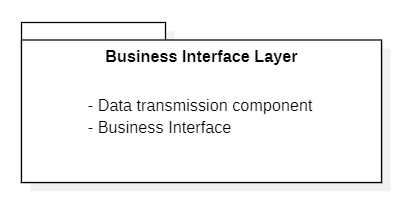
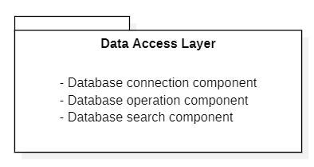
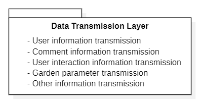

Content
 
[toc]

## 1.Introduction

### 1.1 Purpose

The Sharing Garden project is an initiative that responds to the national call for energy conservation and emission reduction, aiming to build a green and low-carbon campus. It actively promotes the development of a scientific, low-carbon, and efficient resource allocation model to adapt to the evolving landscape of higher education and contribute to ecological civilization. The main action of this project is to transform idle and abandoned land on the campus into shared gardens, designed and built by all students. The project aims to achieve the goal of participatory landscape design, where students can earn credits and rewards, such as potted plants, through their involvement. We will establish a web-based application that includes a toolkit for constructing shared gardens and a community platform for shared garden enthusiasts.

Furthermore, the purpose of this document is to provide a comprehensive and detailed description, outlining the requirements and specifications for a web-based application that supports students in creating and sharing campus garden projects. The web-based application aims to achieve the following objectives:

- Enhance students' learning experience and engagement in environmental education and sustainable development themes by enabling them to design, create, and share their own campus gardens.
- Foster students' creativity and collaboration skills by allowing them to explore and visit other campus gardens.
- Cultivate students' awareness and appreciation of the campus environment and biodiversity.
- Facilitate campus management departments in managing and assessing campus facilities and resources by providing data and feedback on campus gardens.

### 1.2 Progress and Current Status

In the first document, we have already provided readers with a detailed description of the functionalities of Sharing Garden project, and this document covers the progress of analysis model and architectural analysis.

In order to gain a comprehensive understanding of the system and its functionalities, we conducted a System Detailed Analysis. Based on the analysis, we designed a System Hierarchical Architecture that clearly defines 5 subsystems within the system:

- Login & Register System
- Forum   
- Garden Update 
- Garden View   
- Report

 For each subsystem, we created robustness diagrams, class diagrams, and sequence diagrams to illustrate their interactions and behaviors. Furthermore, we updated the existing use case models to enhance their simplicity and clarity.

### 1.3 Changes in the System 

Throughout the system analysis process, we have identified several areas where enhancements and optimizations can be made:

- Simplifying the user experience by implementing intuitive and user-friendly interfaces, ensuring that users can easily navigate and interact with the Shared Garden platform.
- Refining the system's architecture by categorizing classes into three distinct parts: boundary classes, control classes, and entity classes. This clear separation improves the system's clarity, maintainability, and security.
- Making necessary modifications to the use case diagram to accurately reflect the updated system components and user interactions.

These changes aim to streamline the user experience, enhance system reliability, and provide a comprehensive platform for garden enthusiasts. By addressing these areas of improvement, we strive to create a system that not only meets the immediate needs of users but also allows for future scalability and adaptability.

## 2. Architecture Decisions

The "Sharing Garden" project is a web-based application that aims to facilitate the creation and sharing of campus gardens among students. To develop an effective and user-friendly platform, it is crucial to conduct a thorough system analysis and design the architecture accordingly. Our analysis includes a System Detailed Analysis, Hierarchical Architecture Design, and Robustness Diagrams. The key considerations for our architecture design are providing extensive and comprehensive functionality, ensuring the security and privacy of user information, and optimizing platform performance and availability for developers.

### 2.1 System Detailed Analysis

During the requirements phase, we extensively studied the interactions between various system components and external entities. We also conducted a preliminary analysis of the system using use cases. In the early stages of architecture design, we focused on defining the specific behavioral steps required to fulfill each use case. Subsequently, we broke down the system into smaller subsystems based on their functionalities and transformed the use cases into robust graphical representations.

The system can be classified into several subsystems based on their specific functions, including the login and registration system, garden activity management system, garden club management system, member management system, forum system, and personal information maintenance system. Building upon this classification, we established a hierarchical structure for the system, taking into account responsibilities and generalizability, to further divide it into subsystems.

### 2.2 Hierarchical Architecture Design

This system is mainly divided into presentation layer, application layer, business interface layer, business logic layer, data access layer, and communication layer. There is data communication and module invocation between each layer. The overall architecture diagram is shown below.

#### 2.2.1 The presentation layer

The presentation layer is primarily responsible for interacting with users and encapsulating user interaction data to be processed by subsequent layers. It also displays different interfaces based on feedback from the business layer.

- Interface Interaction Component: This component is responsible for presenting different pages to users, facilitating user input. 
- Data Encapsulation Component: It encapsulates and encrypts the data entered by the user. 
- Data Transmission Component: It transmits the user's input data to the business layer for processing.

#### 2.2.2 The application layer

The application layer is one of the core layers of the system, serving as a bridge to coordinate the scheduling and interaction of data between the presentation layer and the business logic layer. During the operation of the system, the application layer receives user requests from the presentation layer and forwards them to the corresponding business logic layer for processing. It is also responsible for transmitting the results returned by the business logic layer to the presentation layer for displaying the processing results to the user.

#### 2.2.3 The business interface layer

The business interface layer is a vital component of the system, responsible for presenting the functionalities of the business logic layer to the outside. It serves as a link between the presentation layer and the business logic layer, receiving data from the presentation layer and passing it to the business interface layer. Depending on the situation, the business interface layer calls different modules from the business logic layer to perform operations.

- Data Transmission Component: Transfers data from the presentation layer to the business logic layer and sends data from the business logic layer to the presentation layer. 
- Business Interface: An interface used to invoke different business operations within the business logic layer.

#### 2.2.4 The business Implementation  layer

The business implementation layer is the core of the overall architecture, playing a crucial role. It is responsible for implementing various business subsystems and transmitting the corresponding processed data to the presentation layer or data access layer.

- Data Transmission Component: Receives data from the data access layer and sends it to the business interface layer. 
- Business Implementation: Handles the implementation logic of different business modules, processes various business requirements, and provides feedback on the processed results or requests to the data transmission module.

#### 2.2.5 The data access layer

The data access layer is a crucial component in the system architecture, responsible for interacting with and accessing the database. It performs different database operations based on the varying data requirements from the business layer.

#### 2.2.6 The data transmission layer

The data transmission layer is a critical component responsible for the transfer of information and signals between the main architectural layers of the system.

### 2.3 Robustness Diagrams

Through the use of robustness diagrams, we can provide a visual representation of the internal structure of each module and the interactions between them. This helps us gain a better understanding of the module's functionality and requirements, laying a foundation for model design. This analysis and design process enables us to better meet the system's functional requirements and ensure its stability and reliability in practical operation.

#### 2.3.1 Login & Register System

#### 2.3.2 Forum System

#### 2.3.3 Garden Update System

#### 2.3.4 Garden View System

#### 2.3.5 Report System

## 3. Analysis Model

### 3.1 Login & Register System

#### 3.1.1 Class Diagram

#### 3.1.2 Interaction Diagram

The following sequence diagram illustrates the system's processing flow during user login. On the login page, users can enter relevant information and click on "Login." The system will check if the password is correct, leading to either a page transition for the user or an error message indicating an incorrect password. On the registration page, users are required to create an account. The system will check if the account already exists. If it does not exist, a new account will be created for the user and saved in the database.

### 3.2 Forum System

#### 3.2.1 Class Diagram

#### 3.2.2 Interaction Diagram

The following sequence diagram illustrates the system's processing flow when a user browses the forum's homepage. Users can click on a page to view detailed content, and the system retrieves the relevant content from the database for display. Users can navigate through the available content on the homepage by clicking on the "Next Page" or "Previous Page" buttons. The system will determine if there is a next or previous page and either display the content of that page or notify the user that the page does not exist.

The following sequence diagram illustrates the interaction process between a user and the system when browsing the comment section of a forum. Users can add comments, reply to comments, delete comments, or like comments. The system will assess the user's permissions and provide feedback accordingly. It will also make modifications to the database as necessary.

### 3.3 Garden Update System

#### 3.3.1 Class Diagram

#### 3.3.2 Interaction Diagram

The following sequence diagram illustrates the scenario where a user requests to modify a garden. When the user clicks on the "Apply" button, the modification request is submitted for backend review. If the review is approved, the system notifies the user of the successful modification and displays the specific details of the garden before and after the modification. It also provides a detailed display of the modified areas. If the review is not approved, the system informs the user that their application has been rejected.

The following sequence diagram illustrates the scenario where a system administrator reviews user requests. The administrator can first click on "View Details," and the system will display the specific details of the garden before and after the modification, including the modified areas. If the administrator clicks on "Approve," the system will mark the request as approved. If the administrator clicks on "Reject," the system will mark the request as rejected.

The following sequence diagram illustrates the system processing flow for a user applying to become a volunteer. The user can first click on "Fill in the relevant information," and the system will store this information in the database. Then, the user can click on the "Join as Volunteer" button to submit an application to the administrator. If the application is approved, the user will receive a system notification indicating the successful application and detailed feedback. If the application is not approved, the user will receive a system notification indicating the unsuccessful application and providing specific reasons.

The following sequence diagram illustrates how an administrator reviews a user's volunteer application. The administrator can click on "View Application Details" to see the detailed information of the application and choose to either accept or reject it.

### 3.4 Garden View System

#### 3.4.1 Class Diagram

#### 3.4.2 Interaction Diagram

The following sequence diagram illustrates how a user can view detailed information about a garden. The user can click on a garden of interest, and the system will retrieve and display specific details about that garden. The user can interact with the interface by liking, rating, and leaving comments. The system will record these actions. Comments will undergo backend review, and if approved, the user can see the published comments. If not approved, the user will receive a notification.

### 3.5 Report System

#### 3.5.1 Class Diagram

#### 3.5.2 Interaction Diagram

The following sequence diagram illustrates the process of a user reporting inappropriate content. The user clicks on the "Report" button, and the system sends the relevant content to undergo backend review. Once the review is complete, the system provides a notification on the interface to inform the user of the review outcome. The user also has the option to cancel the report.

The following sequence diagram illustrates the process of an administrator reviewing reported content. The administrator can view the detailed information of the report and choose to either approve or reject the report.

Additionally, the system supports the administrator's ability to directly delete content. The administrator can click on the delete button to remove inappropriate content directly, and they also have the option to cancel the deletion operation.

## 4. Updated Use Case Model

We originally had five major systems, namely the Login&Register System, Forum System, Garden Maintenance System, Visit System, and Garden Create&Modify&Dismiss System. The Login&Register System remains unchanged, while the other systems undergo certain modifications, including but not limited to:

- The Garden Maintenance System and Garden Create&Modify&Dismiss System are merged into a single system called the Garden Update System.
- The authentication function is removed from all systems, as users who can log in to the system have already completed the identity verification process.
- The Visit System is renamed as the Garden View System, and the reporting functionality for inappropriate content is removed from all systems. Instead, a new Report System is created specifically for students to report incidents to the campus administrators.
- Newly added report system is as the following image shows:

### 4.1 Forum System

The forum system is modified as follows:

- The authentication function has been removed because users who can log into the system are assumed to have already been verified. 
- The reporting functionality for inappropriate content has been removed as there is an additional Report System to handle this task. 
- Due to the absence of authentication and content reporting features, campus administrators are no longer involved as users in this system. 
- The "View Forum Page" feature has been further specialized into "View Column," "View Columns," and "View Comments."

### 4.2 Garden Update System

The garden update system is modified as follows:

- This system combines the original Garden Maintenance System and Garden Create&Modify&Dismiss System, merging the four functions of Maintenance, Create, Modify, and Dismiss into a single feature called Garden Update Apply.

- This system inherits the functionality of the original two systems, which include campus administrators publishing volunteer recruitment information, rewarding volunteers, and allowing students to participate in volunteer activities.

### 4.3 Garden View System

In order to provide more accurate semantics, this system is named "Garden View System" to replace the original system name "Visit System".

- This system specializes the original "View Garden" function into two features: "View Garden Scores" and "View Garden Comments".
- The reporting functionality for inappropriate content has been removed from this system. As a result, the role of campus administrators becomes ineffective as there is no longer a need to review reported content.
- The user authentication function has been removed from this system, as users who can log into the system are assumed to have legal identities by default.

### 4.4 Report System

This is a newly added system that allows student users to report inappropriate content to campus administrators. The specific process is as follows:

- Student users view the comments section of the Forum System or the Garden View System.
- Students identify inappropriate content and report it.
- Campus administrators review the reported content.
- Campus administrators decide whether to delete the inappropriate content based on the situation.
- Campus administrators communicate the outcome of their handling to the student users.

## 5. List of References

This section lists some of the references that can be used for further information and guidance on the software requirements specification. In addition, this section presents some UML diagram drawing tutorials, including class diagrams, robustness diagrams, and sequence diagrams, that we have used as references. With the help of these resources, we have accomplished the analysis and design of the "Sharing Garden" project and created various UML diagrams required throughout the development process.

- Smith, J. (2019). "Introduction to Software Architecture." Medium. [Online]. Available: https://medium.com/@johndoe/introduction-to-software-architecture-123456789. 
- Zhang, L. (2021). "UML Class Diagrams: A Comprehensive Guide." Towards Data Science. [Online]. Available: https://towardsdatascience.com/uml-class-diagrams-a-comprehensive-guide-f27f5923c2c8. 
- W3Schools. "UML Tutorial." [Online]. Available: https://www.w3schools.in/uml-tutorial/. 
- Tutorialspoint. "Software Architecture and Design." [Online]. Available: https://www.tutorialspoint.com/software_architecture_design/index.htm. 
-  https://zhuanlan.zhihu.com/p/78244242
-  https://zhuanlan.zhihu.com/p/109655171
-  https://design-patterns.readthedocs.io/zh_CN/latest/read_uml.html
-  https://juejin.cn/post/6965684798174167076
-  https://zhuanlan.zhihu.com/p/74243228

## 6.Contributions

This project is the result of multiple discussions, revisions, additions, and refinements by two team members. Both members actively participated in the project and took on tasks in each section. We collaborated effectively and contributed to the quality and completeness of the project. The division of labor within the group was average and clear, as follows:

|Student Number|Name|Score Weight|
|---|---|---|
|2050633|Jialin Lu|100%|
|2053711|Jie Chu|100%|