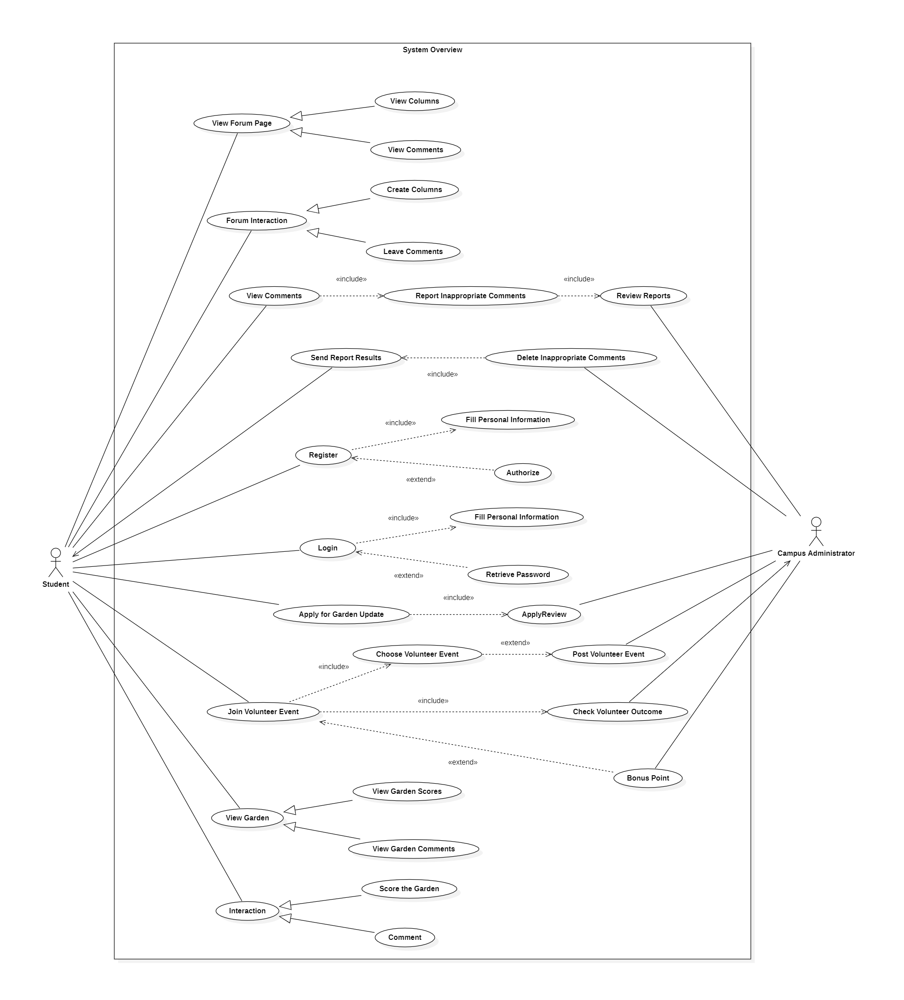

Content
 
[toc]

## 1.Introduction

### 1.1 Purpose

The Sharing Garden project is an initiative that responds to the national call for energy conservation and emission reduction, aiming to build a green and low-carbon campus. It actively promotes the development of a scientific, low-carbon, and efficient resource allocation model to adapt to the evolving landscape of higher education and contribute to ecological civilization. The main action of this project is to transform idle and abandoned land on the campus into shared gardens, designed and built by all students. The project aims to achieve the goal of participatory landscape design, where students can earn credits and rewards, such as potted plants, through their involvement. We will establish a web-based application that includes a toolkit for constructing shared gardens and a community platform for shared garden enthusiasts.

Furthermore, the purpose of this document is to provide a comprehensive and detailed description, outlining the requirements and specifications for a web-based application that supports students in creating and sharing campus garden projects. The web-based application aims to achieve the following objectives:

- Enhance students' learning experience and engagement in environmental education and sustainable development themes by enabling them to design, create, and share their own campus gardens.
- Foster students' creativity and collaboration skills by allowing them to explore and visit other campus gardens.
- Cultivate students' awareness and appreciation of the campus environment and biodiversity.
- Facilitate campus management departments in managing and assessing campus facilities and resources by providing data and feedback on campus gardens.

共享花园项目是响应国家节能减排号召的倡议，旨在建设绿色低碳校园。它积极促进科学、低碳、高效的资源配置模式的发展，以适应高等教育的发展形势，并推动生态文明建设。该项目的主要行动是将校园内的闲置废弃土地改造成共享花园，由所有学生参与设计和建造。这个项目旨在实现参与式景观设计的目标，学生可以通过参与获得积分和奖励，如花卉盆栽。我们将建立一个基于 WEB 的应用程序，其中包括建造共享花园的工具包和共享花园社区。

同时，本文档的目的是提供一个详细而全面的描述，说明支持学生创建和分享校园花园项目的基于WEB的应用程序的需求和规范。基于WEB的应用程序旨在实现以下目标：

- 通过让学生设计、创建和与其他学生分享自己的校园花园，提高学生在环境教育和可持续发展主题方面的学习体验和参与度。
- 通过让学生探索和参观其他校园花园，培养学生的创造力和协作能力。
- 通过让学生了解和欣赏校园环境和生物多样性，提高学生的意识和赞赏。
- 通过为校园管理部门提供有关校园花园的数据和反馈，方便校园管理部门对校园设施和资源的管理和评估。

### 1.2 Progress and Current Status

We have designed the analysis model, user interface, architecture, and class diagram for the Sharing Garden project in the previous report. Now, we have determined the microservice architecture for the project. We will provide the technical and logical architecture models, specific interfaces, analysis mechanisms, and system prototype design. Our focus is on implementing the project using the main technologies and applying design patterns. The main improvements include reconfiguring the logical architecture, adding technical and physical architectures, implementing specific interfaces, enhancing security and reliability with API gateway and data persistence, and analyzing use cases in relation to system structure.

The main improvements in our system are as follows:

1. Logical Architecture: We have reconfigured the logical architecture by incorporating analysis mechanisms, resulting in a more efficient and streamlined system design.
2. Technical and Physical Architectures: In addition to the logical architecture, we have added the technical and physical architectures, specifying the required technology stack for each layer and providing deployment strategies at the physical level.
3. Specific Interfaces: We have introduced specific interfaces tailored to our new subsystem, including detailed specifications for parameter types and return value types. We have also provided comprehensive instructions for integrating third-party APIs and interfacing with various subsystems.
4. Analysis Mechanisms: We have analyzed the system's mechanisms and selected appropriate design patterns to optimize the system's performance, maintainability, and scalability.
5. Use of Design Patterns: We have applied relevant design patterns throughout the system design process to improve code structure, code reusability, and overall system maintainability.
6. Use Case Analysis: We have analyzed the implementation process of use cases in conjunction with the system's structure, ensuring that the system meets the intended requirements and objectives.

我们在之前的报告中为共享花园项目设计了分析模型、用户界面、架构和类图。现在，我们确定了项目的微服务架构。我们将提供技术和逻辑架构模型、具体接口、分析机制和系统原型设计。我们的重点是使用主要技术实现项目并应用设计模式。

我们系统的主要改进如下：

1. 逻辑架构：通过引入分析机制，我们重新配置了逻辑架构，使系统设计更加高效和流畅。
2. 技术和物理架构：除了逻辑架构，我们还添加了技术和物理架构，明确了每个层所需的技术栈，并提供了物理层面的部署策略。
3. 具体接口：我们引入了针对新子系统的具体接口，包括参数类型和返回值类型的详细规范。我们还提供了与第三方API集成和各个子系统接口交互的全面说明。
4. 分析机制：我们对系统的机制进行了分析，并选择了合适的设计模式来优化系统的性能、可维护性和可扩展性。
5. 设计模式的应用：我们在整个系统设计过程中应用了相关的设计模式，改善了代码结构、代码可重用性和整体系统的可维护性。
8. 用例分析：我们结合系统结构分析了用例的实现过程，确保系统满足预期的需求和目标。

## 2. Updated Use Cases

The overview of updated use case model is demonstrated below.

We have further refined and improved the use case diagram, making modifications to the previous assignment's less reasonable use case divisions. We have provided detailed logical relationships between use cases with extend relationships, such as:

- The reporting and review system has been managed as a separate subsystem, which interacts with other subsystems, reducing component redundancy among the subsystems.

- Some use cases for viewing the forum and viewing the garden comments section have been merged, allowing both subsystems to share system resources and components, optimizing system performance.

### 2.1 Report System

This is a newly added system that allows student users to report inappropriate content to campus administrators. The specific process is as follows:

- Student users view the comments section of the Forum System or the Garden View System.
- Students identify inappropriate content and report it.
- Campus administrators review the reported content.
- Campus administrators decide whether to delete the inappropriate content based on the situation.
- Campus administrators communicate the outcome of their handling to the student users.

### 2.2 Garden View System

In order to provide more accurate semantics, this system is named "Garden View System" to replace the original system name "Visit System".

- This system specializes the original "View Garden" function into two features: "View Garden Scores" and "View Garden Comments".
- The reporting functionality for inappropriate content has been removed from this system. As a result, the role of campus administrators becomes ineffective as there is no longer a need to review reported content.
- The user authentication function has been removed from this system, as users who can log into the system are assumed to have legal identities by default.

为了使得语义更准确，本系统以"Garden View System"为名，以替换原本的系统名"Visit System"。

- 本系统将原本的View Garden功能特化成了两个功能View Garden Scores和View Garden Comments
- 本系统删除了原系统的不良内容举报功能，由于不需要审核不良内容了，于是此处校园管理员的功能也就失效了。
- 本系统删去了用户身份验证功能，因为能登入系统的用户默认身份为合法的。

## 3. Architecture Refinement

### 3.1 Platform-dependent Architecture

【需要几张微服务架构示例图】

In the previous design of the Sharing Garden project's logical architecture, our focus was on ensuring the system's internal functions' integrity and data transmission security. By combining the actual technical and physical models, we decided to enhance and upgrade the logical architecture of the system using a microservice architecture system based on domain-driven design.

The decision to transition from a layered architecture to a microservice architecture in this project was driven by several reasons. Firstly, the services provided by the Keizai community exchange platform are relatively complete and independent, allowing us to package them into different microservice clusters for utilization by other systems. This modular approach improves reusability and interoperability.

Secondly, microservice development offers flexibility and supports fast iteration, enabling rapid updates and enhancements. With microservices, individual services can be developed and deployed independently, leading to increased agility in the development process. This allows for faster iterations and the ability to respond quickly to changing requirements.

Another advantage of microservice architecture lies in the high cohesion within services and loose coupling between them. Each microservice focuses on a specific business capability and can be independently developed, deployed, and scaled. This loose coupling ensures that changes made to one microservice do not impact the entire system, making maintenance and scalability easier.

Considering these characteristics of microservice architecture, and after careful evaluation of its pros and cons compared to traditional layered architecture, we made the decision to generalize and refine the previous architecture's layers appropriately. This approach allows us to design a system architecture with complete internal functionality, high security, and lightweight characteristics. The result is a logical architecture diagram that embodies these goals and serves as the foundation for the improved community exchange platform.

在之前的关系花园项目逻辑架构设计中，我们注重系统内部功能的完整性和数据传输的安全性，并结合实际技术和物理模型的设计，我们选择使用基于领域驱动设计的微服务架构系统来完成系统逻辑架构的改进和升级。

选择从分层架构过渡到微服务架构的原因如下：
1. 经济社区交流平台提供的服务相对完整且独立，可以将其打包成不同的微服务集群供其他系统使用。这种模块化的方法提高了可重用性和互操作性。

2. 微服务开发具有灵活性，支持快速迭代，能够快速更新和增强。通过微服务，各个服务可以独立开发和部署，提高了开发过程中的灵活性，使得迭代更快、能够快速响应需求变化。

3. 微服务架构中的不同服务独立部署，服务内部高内聚、服务之间松耦合。每个微服务专注于特定的业务能力，可以独立开发、部署和扩展。这种松耦合确保对一个微服务的更改不会影响整个系统，使得维护和扩展更加容易。

考虑到微服务架构的上述特点，并在权衡了微服务架构与传统分层架构的优缺点后，我们选择对之前的架构进行适当的泛化和细化。这种方法使我们能够设计一个具有完整内部功能、高安全性和轻量级特性的系统架构。结果是一个体现这些目标并成为改进的社区交流平台基础的逻辑架构图。

### 3.2 Subsystems and Interfaces

### 3.3 Interface Specification

### 3.4 Subsystem Interfaces Example

## 4. Design Models

### 4.1 Login & Register System

#### 4.1.1 Design Model

【要接口的设计模型图】

#### 4.1.2 Sequence Diagram

The following sequence diagram illustrates the system's processing flow during user login. On the login page, users can enter relevant information and click on "Login." The system will check if the password is correct, leading to either a page transition for the user or an error message indicating an incorrect password. On the registration page, users are required to create an account. The system will check if the account already exists. If it does not exist, a new account will be created for the user and saved in the database.

下面的时序图展示了用户登陆时系统的处理过程。在登陆页面，用户可以输入相关信息后点击登陆，系统会检查密码是否正确，从而让用户的界面跳转或提示密码错误。注册页面则需要用户创建账号，系统会检查账号是否已存在，若不存在则为其创建新账号并保存在数据库中。

### 4.2 Forum System

#### 4.2.1 Design Model

#### 4.2.2 Sequence Diagram

The following sequence diagram illustrates the system's processing flow when a user browses the forum's homepage. Users can click on a page to view detailed content, and the system retrieves the relevant content from the database for display. Users can navigate through the available content on the homepage by clicking on the "Next Page" or "Previous Page" buttons. The system will determine if there is a next or previous page and either display the content of that page or notify the user that the page does not exist.

下面的时序图展示了用户浏览论坛首页时系统的处理过程。用户可以点进展示详细内容的页面，系统从数据库中取出相关内容进行展示。用户可以点击下一页、上一页来翻阅首页存在的内容，系统会判断是否还存在下一页或上一页，从而选择展示这一页的内容或提示用户该页不存在。

The following sequence diagram illustrates the interaction process between a user and the system when browsing the comment section of a forum. Users can add comments, reply to comments, delete comments, or like comments. The system will assess the user's permissions and provide feedback accordingly. It will also make modifications to the database as necessary.

这张时序图则展现了用户浏览论坛评论区时与系统的交互过程。用户可以添加评论，回复评论，删除评论或点赞评论。系统会判断用户权限并给予反馈和进行数据库的修改。

### 4.3 Garden Update System

#### 4.3.1 Design Model

#### 4.3.2 Interaction Diagram

The following sequence diagram illustrates the scenario where a user requests to modify a garden. When the user clicks on the "Apply" button, the modification request is submitted for backend review. If the review is approved, the system notifies the user of the successful modification and displays the specific details of the garden before and after the modification. It also provides a detailed display of the modified areas. If the review is not approved, the system informs the user that their application has been rejected.

下面的时序图展示的情况是用户请求修改花园。用户点击申请后，申请会递交后端审核。若审核通过，则系统提示修改成功并向用户展示修改前后的花园具体信息、详细展示了修改的地方。若审核未通过，则需要提升用户申请失败。

The following sequence diagram illustrates the scenario where a system administrator reviews user requests. The administrator can first click on "View Details," and the system will display the specific details of the garden before and after the modification, including the modified areas. If the administrator clicks on "Approve," the system will mark the request as approved. If the administrator clicks on "Reject," the system will mark the request as rejected.

这张时序图说明的情况是系统管理员审核用户发送的请求。管理员可以首先点击查看详细信息，系统会展示修改前后的具体情况和修改的部位。如果管理员点击通过，则系统将该申请记录为已通过；如果点击拒绝，则系统将该申请记录为已拒绝。

The following sequence diagram illustrates the system processing flow for a user applying to become a volunteer. The user can first click on "Fill in the relevant information," and the system will store this information in the database. Then, the user can click on the "Join as Volunteer" button to submit an application to the administrator. If the application is approved, the user will receive a system notification indicating the successful application and detailed feedback. If the application is not approved, the user will receive a system notification indicating the unsuccessful application and providing specific reasons.

这张时序图展现了用户申请成为志愿者的系统处理过程。用户可以先点击填写相关信息，并由系统存储在数据库中。接着，用户可以点击加入志愿者按钮，向管理员递交申请。如果通过，则用户收到系统的申请成功提示和反馈的详细说明信息；如果未通过，则用户收到系统的申请失败提示和具体原因。

The following sequence diagram illustrates how an administrator reviews a user's volunteer application. The administrator can click on "View Application Details" to see the detailed information of the application and choose to either accept or reject it.

这张时序图则展示了管理员如何审核用户的志愿者申请。与审核花园修改请求类似，管理员可以点击查看申请的详细信息，并选择接受或拒绝申请。

### 4.4 Garden View System

#### 4.4.1 Design Model

#### 4.4.2 Interaction Diagram

The following sequence diagram illustrates how a user can view detailed information about a garden. The user can click on a garden of interest, and the system will retrieve and display specific details about that garden. The user can interact with the interface by liking, rating, and leaving comments. The system will record these actions. Comments will undergo backend review, and if approved, the user can see the published comments. If not approved, the user will receive a notification.

这张时序图展现了用户如何查看花园详细信息。用户可以点击感兴趣的花园，系统会返回该花园的具体情况。用户可以在界面中点赞、评分和留下评论，系统会记录这些操作。其中评论会交由后端审核，若通过则用户可以看见发布的评论，若未通过用户也会收到提示。

### 4.5 Report System

#### 4.5.1 Design Model

#### 4.5.2 Interaction Diagram

The following sequence diagram illustrates the process of a user reporting inappropriate content. The user clicks on the "Report" button, and the system sends the relevant content to undergo backend review. Once the review is complete, the system provides a notification on the interface to inform the user of the review outcome. The user also has the option to cancel the report.

这张时序图展现了用户举报不良内容的过程。用户点击举报按钮，系统会把相关内容送往后端审核，审核结果会在审核结束后返回界面提示用户。用户也可以选择取消举报。

The following sequence diagram illustrates the process of an administrator reviewing reported content. The administrator can view the detailed information of the report and choose to either approve or reject the report.

下面的时序图展现了管理员审核举报的过程。管理员可以查看举报详细内容，并选择通过或拒绝举报。

Additionally, the system supports the administrator's ability to directly delete content. The administrator can click on the delete button to remove inappropriate content directly, and they also have the option to cancel the deletion operation.

此外，系统还支持管理员直接对内容进行删除的操作。管理员可以通过点击删除按钮直接删除不良内容，也可以取消删除操作。

## 5. Critical Design Decisions

1. Platform Selection: We used a thorough evaluation process to select the most suitable platform that aligns with our system requirements. After careful consideration, we chose VSCode with related extensions to support our development and deployment needs. This platform offers robust compatibility with our target operating system, programming language, and cloud service provider, allowing us to achieve scalability, performance, and availability objectives.
2. Data Storage Solution: To meet our data storage requirements, we implemented a comprehensive evaluation of different options. After careful consideration, we decided to use the Oracle Database Management System. This choice allows us to store and manage our data efficiently, ensuring scalability, data consistency, and query performance as required by our system.
3. Security Strategy: We prioritized the security of our system and user data by implementing a robust security strategy. To achieve this, we adopted the OAuth 2.0 security framework. This framework provides a comprehensive set of authentication mechanisms, access control policies, data encryption methods, and vulnerability management procedures. By implementing this strategy, we ensure the confidentiality, integrity, and availability of our system.
4. Scalability Design: In anticipation of future scalability requirements, we employed a scalable design approach. By leveraging the Kubernetes architecture pattern, we designed our system to handle increasing user loads and data volumes. This approach enables horizontal scaling, distributed computing, load balancing, and caching strategies, ensuring the scalability and responsiveness of our system.
5. Performance Optimization: To optimize system performance, we conducted thorough performance analysis and implemented performance optimization techniques. Leveraging the Redis profiling tools and optimization strategies, we optimized critical areas such as algorithms, database queries, network communication, and resource utilization. This allowed us to achieve improved response time, throughput, and resource efficiency.
6. User Interface Design: We prioritized an exceptional user experience by focusing on intuitive and visually appealing user interfaces. Leveraging Vue3 framework , we created user interfaces that align with user workflows, responsiveness, accessibility, and visual aesthetics. This approach maximizes user satisfaction, ease of use, and adoption of our system.
7. Documentation: We recognized the importance of clear documentation and training materials for effective system understanding and usage. We developed comprehensive system documentation, including architecture diagrams, API documentation, and user guides.

1. 平台选择：我们采用了一套全面的评估流程来选择与我们系统需求相符的最合适平台。经过仔细考虑，我们选择了VSCode并使用相关扩展来支持我们的开发和部署需求。这个平台与我们的目标操作系统、编程语言和云服务提供商具有强大的兼容性，使我们能够实现可扩展性、性能和可用性的目标。

2. 数据存储解决方案：为了满足我们的数据存储需求，我们对不同选项进行了全面的评估。经过仔细考虑，我们决定使用Oracle数据库管理系统。这个选择能够高效地存储和管理我们的数据，确保系统按照要求具备可扩展性、数据一致性和查询性能。

3. 安全策略：我们通过实施强大的安全策略来优先考虑系统和用户数据的安全性。为了实现这一目标，我们采用了OAuth 2.0安全框架。该框架提供了一套全面的身份验证机制、访问控制策略、数据加密方法和漏洞管理程序。通过实施这一策略，我们确保系统的机密性、完整性和可用性。

4. 可扩展性设计：为了满足未来的可扩展性需求，我们采用了可扩展的设计方法。通过利用Kubernetes架构模式，我们设计了一个能够处理日益增长的用户负载和数据量的系统。这种方法实现了横向扩展、分布式计算、负载均衡和缓存策略，确保了我们系统的可扩展性和响应性。

5. 性能优化：为了优化系统性能，我们进行了全面的性能分析，并实施了性能优化技术。利用Redis性能分析工具和优化策略，我们优化了关键领域，如算法、数据库查询、网络通信和资源利用。这使我们能够实现更好的响应时间、吞吐量和资源效率。

6. 用户界面设计：我们通过专注于直观和视觉吸引力的用户界面来优先考虑出色的用户体验。利用Vue3框架，我们创建了与用户工作流程、响应性、可访问性和视觉美感相符的用户界面。这种方法最大限度地提高了用户满意度、易用性和对我们系统的采用率。

7. 文档：我们意识到清晰的文档和培训资料对于有效理解和使用系统的重要性。我们制定了全面的系统文档，包括架构图、API文档和用户指南。

## 6. Architectural Styles

In the Sharing Garden project, we adopted the microservices architecture style to build the entire system. Microservices architecture is a service-oriented architectural style that breaks down a large application into a set of smaller, autonomous services that collaborate to fulfill business requirements.

Microservices architecture offers the following advantages:

- Resilience and scalability: Microservices architecture allows independent scaling of each service based on demand, rather than scaling the entire system. This makes the system more resilient and able to handle high loads and traffic spikes, while also facilitating horizontal scaling.
- Independent development and deployment: Each microservice is autonomous and can be developed, tested, and deployed by independent teams. This decoupled nature improves development efficiency and enables teams to iterate and release services independently, without requiring system-wide downtime.

- Technological diversity: Microservices architecture encourages the use of different technology stacks and programming languages for building individual services, allowing teams to choose the most suitable technologies for their needs. This flexibility enhances the creativity and productivity of development teams.
- High availability and fault tolerance: By splitting the system into multiple services, microservices architecture ensures that the failure of a single service does not impact the availability of the entire system. Additionally, clear interfaces between services make it easier to implement fault tolerance mechanisms such as timeouts and failovers.

Microservices architecture is particularly suitable for complex applications, especially in the following scenarios:

- Projects that require rapid iteration and release of new features.
- Systems that need to support multiple platforms and devices.
- Environments that require scalability and adaptability to changing business needs.
- Projects that aim to improve team independence and collaboration efficiency.

Microservices architecture exhibits the following key characteristics:

- Single responsibility: Each microservice focuses on solving a specific business problem and has its own independent responsibilities.
- Loose coupling: Microservices communicate with each other through well-defined interfaces, maintaining relative independence.
- Distributed data management: Each service can have its own data storage, choosing a database or storage solution that suits its needs.
- Infrastructure automation: Microservices architecture relies on automated deployment, monitoring, and scaling to better handle system complexity.

In the Sharing Garden project, we divided the system into multiple microservices, such as user management, resource sharing, and permission control. Each microservice is developed and deployed independently, with clear API interfaces for communication between them. We utilize containerization technology (e.g., Docker) for deploying and managing microservices and container orchestration tools (e.g., Kubernetes) for coordinating and scaling service runtime. Through this approach, we achieve system resilience, scalability, and the benefits of independent development and deployment, effectively meeting the requirements of the Sharing Garden project.

在Sharing Garden项目中，我们采用了微服务架构风格来构建整个系统。微服务架构是一种面向服务的架构风格，它将一个大型的应用程序拆分为一组较小的、自治的服务，这些服务相互协作来完成业务需求。

微服务架构具有如下优点：

弹性和可伸缩性：微服务架构允许根据需求独立扩展每个服务，而不是整个系统。这使得系统更具弹性，能够应对高负载和流量峰值的情况，同时也更容易进行水平扩展。
独立开发和部署：每个微服务都是自治的，可以由独立的团队开发、测试和部署。这种解耦合的特性提高了开发效率，并且允许团队根据业务需求独立迭代和发布服务，而无需整体系统的停机。
技术多样性：微服务架构鼓励使用不同的技术栈和编程语言来构建各个服务，使团队能够选择最适合其需求的技术。这种灵活性有助于提高开发团队的创造力和效率。
高可用性和容错性：微服务架构通过将系统拆分为多个服务，使得单个服务的故障不会影响整个系统的可用性。同时，由于服务之间通过清晰的接口进行通信，可以更容易地实现容错机制，例如超时处理和故障转移。

微服务架构适用于复杂的应用程序，尤其是在以下情况下更为合适：

需要快速迭代和发布新功能的项目。
需要支持多平台、多设备的系统。
需要扩展和适应不断变化的业务需求。
需要提高团队的独立性和协作效率。

微服务架构具有以下基本特征：

单一责任：每个微服务关注于解决特定的业务问题，具有独立的职责。
松耦合：微服务之间通过明确定义的接口进行通信，彼此之间相对独立。
分布式数据管理：每个服务可以有自己的数据存储，可以选择适合其需求的数据库或数据存储方案。
基础设施自动化：微服务架构倚赖自动化的部署、监控和扩展，以便更好地应对系统的复杂性。

在Sharing Garden项目中，我们将系统拆分为多个微服务，如用户管理、资源分享、权限控制等。每个微服务独立开发和部署，通过定义清晰的API接口实现彼此之间的通信。我们使用了容器化技术（例如Docker）来实现微服务的部署和管理，使用容器编排工具（例如Kubernetes）来协调和扩展服务的运行。通过这种方式，我们能够实现系统的弹性和可伸缩性，以及独立开发和部署的优势，从而更好地满足Sharing Garden项目的需求。

## 7. List of References

This section lists the references and sources consulted to complete this document, most of which are from open-source communities such as internet blogs, forums, etc. These sources are provided by the author without copyright restrictions and can be used for further information and guidance.

- Smith, J. (2019). "Introduction to Software Architecture." Medium. [Online]. Available: https://medium.com/@johndoe/introduction-to-software-architecture-123456789. 
- Zhang, L. (2021). "UML Class Diagrams: A Comprehensive Guide." Towards Data Science. [Online]. Available: https://towardsdatascience.com/uml-class-diagrams-a-comprehensive-guide-f27f5923c2c8. 
- W3Schools. "UML Tutorial." [Online]. Available: https://www.w3schools.in/uml-tutorial/. 
- Tutorialspoint. "Software Architecture and Design." [Online]. Available: https://www.tutorialspoint.com/software_architecture_design/index.htm. 

- https://design-patterns.readthedocs.io/zh_CN/latest/read_uml.html

- 30 Minutes to Learn UML Class Diagram - Article by Xiao Jichao - Zhihu https://zhuanlan.zhihu.com/p/109655171

- 15 Commonly Used Design Patterns, Recommended for Bookmarking - Article by Ciki - Zhihu https://zhuanlan.zhihu.com/p/497208231

- Come on Baby! You Can Become a Web Development Engineer Too! - The Complete Guide to Becoming a Web Development Engineer - Article by Yu Bolun - Zhihu https://zhuanlan.zhihu.com/p/22978846

- One Article to Understand What Architecture Patterns and Architectural Styles Are - Article by Programmer Guli Ji - Zhihu https://zhuanlan.zhihu.com/p/96180863

- A Quick Understanding of Five Major Architectural Styles in One Diagram - Article by Wanmao Study Society - Zhihu https://zhuanlan.zhihu.com/p/429046857

## 8.Contributions

This project is the result of multiple discussions, revisions, additions, and refinements by two team members. Both members actively participated in the project and took on tasks in each section. We collaborated effectively and contributed to the quality and completeness of the project. The division of labor within the group was average and clear, as follows:

这个项目是两位小组成员经过多次讨论、修改、补充和完善得到的。两位成员都积极参与了项目，并在每个部分都承担了任务。我们有效地合作，为项目的质量和完整性做出了贡献。任务分配平均而清晰，如下所示：

|Student Number|Name|Score Weight|
|---|---|---|
|2050633|Jialin Lu|100%|
|2053711|Jie Chu|100%|