
Content
 
[toc]

## 1.Introduction

### 1.1 Purpose

The Sharing Garden project is an initiative that responds to the national call for energy conservation and emission reduction, aiming to build a green and low-carbon campus. It actively promotes the development of a scientific, low-carbon, and efficient resource allocation model to adapt to the evolving landscape of higher education and contribute to ecological civilization. The main action of this project is to transform idle and abandoned land on the campus into shared gardens, designed and built by all students. The project aims to achieve the goal of participatory landscape design, where students can earn credits and rewards, such as potted plants, through their involvement. We will establish a web-based application that includes a toolkit for constructing shared gardens and a community platform for shared garden enthusiasts.

Furthermore, the purpose of this document is to provide a comprehensive and detailed description, outlining the requirements and specifications for a web-based application that supports students in creating and sharing campus garden projects. The web-based application aims to achieve the following objectives:

- Enhance students' learning experience and engagement in environmental education and sustainable development themes by enabling them to design, create, and share their own campus gardens.
- Foster students' creativity and collaboration skills by allowing them to explore and visit other campus gardens.
- Cultivate students' awareness and appreciation of the campus environment and biodiversity.
- Facilitate campus management departments in managing and assessing campus facilities and resources by providing data and feedback on campus gardens.

### 1.2 Progress and Current Status

We have designed the analysis model, user interface, architecture, and class diagram for the Sharing Garden project in the previous report. Now, we have determined the microservice architecture for the project. We will provide the technical and logical architecture models, specific interfaces, analysis mechanisms, and system prototype design. Our focus is on implementing the project using the main technologies and applying design patterns. The main improvements include reconfiguring the logical architecture, adding technical and physical architectures, implementing specific interfaces, enhancing security and reliability with API gateway and data persistence, and analyzing use cases in relation to system structure.

The main improvements in our system are as follows:

1. Logical Architecture: We have reconfigured the logical architecture by incorporating analysis mechanisms, resulting in a more efficient and streamlined system design.
2. Technical and Physical Architectures: In addition to the logical architecture, we have added the technical and physical architectures, specifying the required technology stack for each layer and providing deployment strategies at the physical level.
3. Specific Interfaces: We have introduced specific interfaces tailored to our new subsystem, including detailed specifications for parameter types and return value types. We have also provided comprehensive instructions for integrating third-party APIs and interfacing with various subsystems.
4. Analysis Mechanisms: We have analyzed the system's mechanisms and selected appropriate design patterns to optimize the system's performance, maintainability, and scalability.
5. Use of Design Patterns: We have applied relevant design patterns throughout the system design process to improve code structure, code reusability, and overall system maintainability.
6. Use Case Analysis: We have analyzed the implementation process of use cases in conjunction with the system's structure, ensuring that the system meets the intended requirements and objectives.

## 2. Updated Use Cases

The overview of updated use case model is demonstrated below.

We have further refined and improved the use case diagram, making modifications to the previous assignment's less reasonable use case divisions. We have provided detailed logical relationships between use cases with extend relationships, such as:

- The reporting and review system has been managed as a separate subsystem, which interacts with other subsystems, reducing component redundancy among the subsystems.

- Some use cases for viewing the forum and viewing the garden comments section have been merged, allowing both subsystems to share system resources and components, optimizing system performance.

### 2.1 Report System

This is a newly added system that allows student users to report inappropriate content to campus administrators. The specific process is as follows:

- Student users view the comments section of the Forum System or the Garden View System.
- Students identify inappropriate content and report it.
- Campus administrators review the reported content.
- Campus administrators decide whether to delete the inappropriate content based on the situation.
- Campus administrators communicate the outcome of their handling to the student users.

### 2.2 Garden View System

In order to provide more accurate semantics, this system is named "Garden View System" to replace the original system name "Visit System".

- This system specializes the original "View Garden" function into two features: "View Garden Scores" and "View Garden Comments".
- The reporting functionality for inappropriate content has been removed from this system. As a result, the role of campus administrators becomes ineffective as there is no longer a need to review reported content.
- The user authentication function has been removed from this system, as users who can log into the system are assumed to have legal identities by default.

## 3. Architecture Refinement

### 3.1 Platform-dependent Architecture

In the previous design of the Sharing Garden project's logical architecture, our focus was on ensuring the system's internal functions' integrity and data transmission security. By combining the actual technical and physical models, we decided to enhance and upgrade the logical architecture of the system using a microservice architecture system based on domain-driven design.

The decision to transition from a layered architecture to a microservice architecture in this project was driven by several reasons. 

- Firstly, the services provided by the Keizai community exchange platform are relatively complete and independent, allowing us to package them into different microservice clusters for utilization by other systems. This modular approach improves reusability and interoperability.

- Secondly, microservice development offers flexibility and supports fast iteration, enabling rapid updates and enhancements. With microservices, individual services can be developed and deployed independently, leading to increased agility in the development process. This allows for faster iterations and the ability to respond quickly to changing requirements.

- Another advantage of microservice architecture lies in the high cohesion within services and loose coupling between them. Each microservice focuses on a specific business capability and can be independently developed, deployed, and scaled. This loose coupling ensures that changes made to one microservice do not impact the entire system, making maintenance and scalability easier.

Considering these characteristics of microservice architecture, and after careful evaluation of its pros and cons compared to traditional layered architecture, we made the decision to generalize and refine the previous architecture's layers appropriately. This approach allows us to design a system architecture with complete internal functionality, high security, and lightweight characteristics. The result is a logical architecture diagram that embodies these goals and serves as the foundation for the improved community exchange platform.

Based on the aforementioned characteristics of microservice architecture and a thorough evaluation of its advantages and disadvantages compared to traditional layered architecture, we propose a refined logical architecture to achieve a system design that encompasses comprehensive internal functionality, high security, and lightweight attributes. The diagram of the logical architecture is demonstrated below.

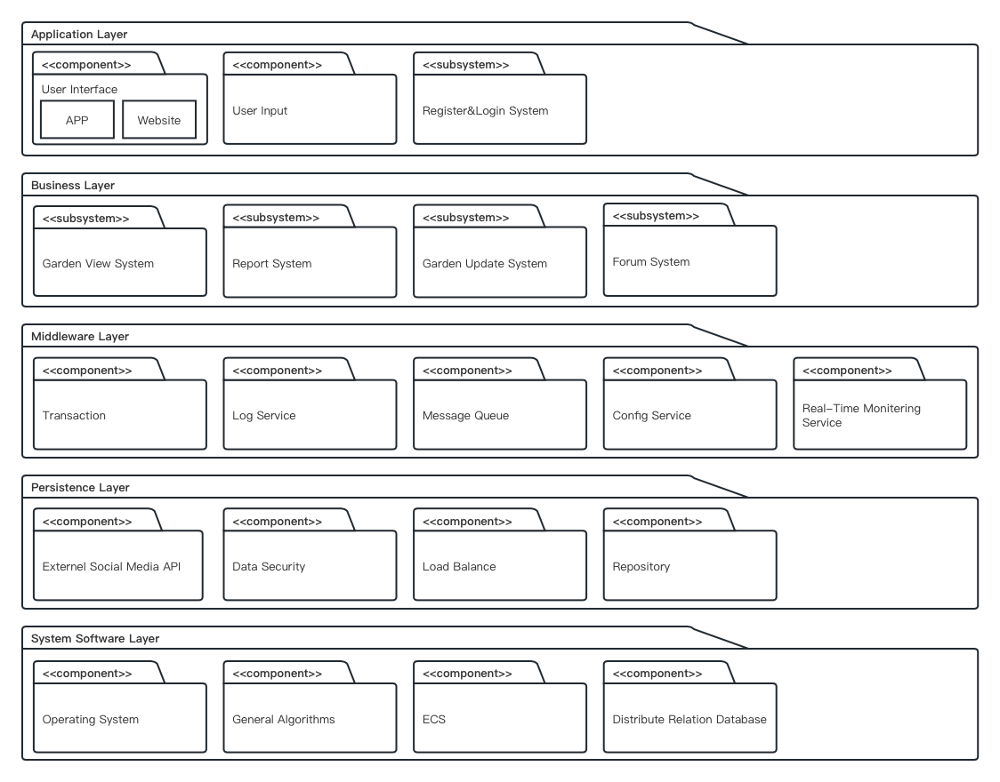

Based on the above logical architecture, to adapt the microservices architecture to the project scale, we adopt a separate front-end and back-end development approach. The front-end development utilizes libraries such as Vue and Flutter, while the back-end development is generally done using SpringBoot and SpringCloud. Communication between the front-end and back-end occurs through REST-style API calls and JSON data files. Different layers communicate and convert data through various data models (e.g., VO, DTO, DO). The system employs sa-token for authorization and authentication, ELK for comprehensive log collection and data analysis visualization, and activeMQ message queues to effectively handle asynchronous messages and traffic clipping. The back-end exchanges data with an Oracle database or Redis cache using Hibernate's persistence mechanism. The system accounts for the high request traffic of a ticketing system in a short time and implements request traffic reduction using funnels. During the business flow, each layer performs business verification and filtering to ensure account security, purchase eligibility, and the normal status of basic information like theaters and cinemas. The system also verifies the normal status of goods to be purchased and checks for the completion of time-limited offers. Illegal requests are filtered out at each level, processing only valid requests at the final stage, thus reducing the write operation traffic from requests to the database. Cache expiration length control is implemented, with VO objects and DO objects of underlying data entities using different expiration length policies based on static or dynamic data. The final design of the development architecture is as follows:

1. Separate front-end and back-end development: Front-end development using Vue, Flutter, and other libraries; back-end development using SpringBoot and SpringCloud.
2. Communication via REST API and JSON: Front-end and back-end communicate through REST API and JSON.
3. Authorization and authentication: Implementation of authorization and authentication using sa-token.
4. Log collection and data analysis visualization: Comprehensive log collection and data analysis visualization using ELK.
5. Asynchronous message handling: Utilization of activeMQ message queues for asynchronous message delivery and storage.
6. Data exchange: Back-end exchanges data with an Oracle database or Redis cache using Hibernate's persistence mechanism.
7. Request traffic reduction: Implementation of traffic reduction using funnels to handle high request traffic.
8. Filtering illegal requests: Business flow includes verification and filtering of illegal requests at each layer.
9. Cache expiration length control: Different expiration length policies for VO and DO objects based on static or dynamic data.

Based on the aforementioned architecture design, the final development architecture is as described below.

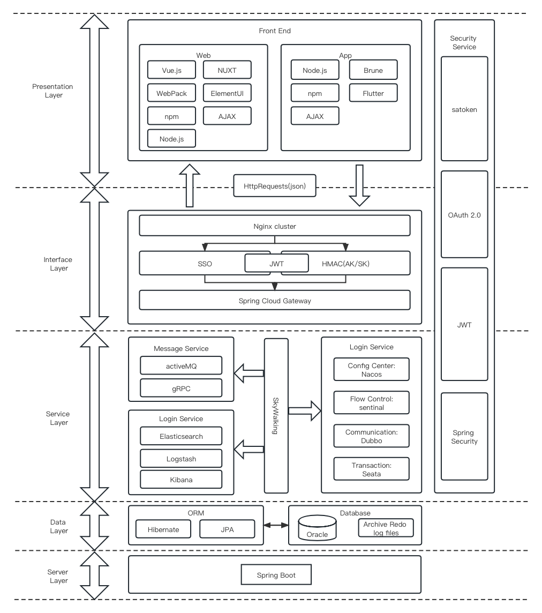

To depict the physical implementation of the system, a deployment diagram is used to illustrate the mapping between the logical and physical architecture. Leveraging the microservice architecture, the system employs a cluster of service registries and configuration centers, along with three clusters of servers with distinct functions to facilitate intercommunication among microservices.

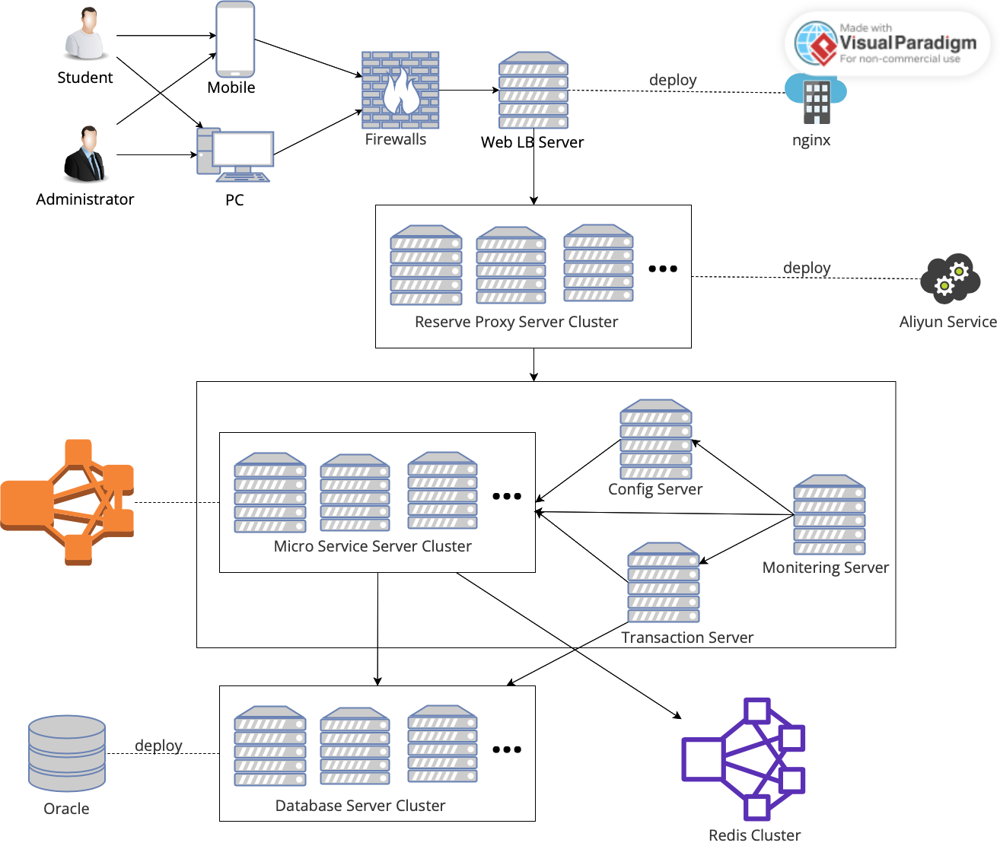

### 3.2 Subsystems and Interfaces

#### 3.2.1 Login & Register System

**Interface Class: AccountManagement**

- Interface Functions:
  - getUserID(): userID [Get user ID]
  - getRegisterStatus(userID): registerStatus [Get registration status]
  - login(userID, password): bool [User login]
  - logout(userID): bool [User logout]
  - updateAccountInfo(userID, newInfo): bool [Update account information]

**Interface Class: Registration**

- Interface Functions:
  - getAccountInfo(userID): accountInfo [Get user account information]
  - checkUsernameAvailability(username): bool [Check username availability]
  - register(userID, password, email): userID [User registration]
  - confirmEmail(userID): bool [Confirm email]

**Interface Class: PasswordManagement**

- Interface Functions:
  - changePassword(userID, oldPassword, newPassword): bool [Change password]
  - resetPassword(userID, email): bool [Reset password]
  - getPasswordStrength(password): passwordStrength [Get password strength]

**Interface Class: SecurityQuestions**

- Interface Functions:
  - getSecurityQuestions(userID): securityQuestions [Get security questions]
  - answerSecurityQuestions(userID, answers): bool [Answer security questions]
  - updateSecurityQuestions(userID, newQuestions, newAnswers): bool [Update security questions and answers]

**Dependent External Interface Classes:**

- External Email API
- Notification API

#### 3.2.2 Forum System

**Interface Class: Forum**

- Interface Functions:
  - getForumList(): forum list [Get forum list]
  - showForumInfo(forumID): info [Get detailed information of a forum]
  - sortForumByActivity(): forum list [Sort forums by activity]
  - sortForumByLatestColumn(): forum list [Sort forums by the latest posts]
  - chooseForum(forumID): forum_choice [Choose a forum]
  - sendForumChoice(forum_choice): bool [Send the selected forum]

**Interface Class: Column**

- Interface Functions:
  - showColumnList(forumID): column list [Get the list of posts in a forum]
  - chooseColumn(forumID, columnID): column_choice [Choose a post]
  - sendColumnChoice(column_choice): bool [Send the selected post]
  - createColumn(forumID, userId, title, content): columnId [Create a new post]
  - deleteColumn(forumID, userId, columnId): bool [Delete a post]

**Interface Class: Comment**

- Interface Functions:
  - showCommentList(columnID): comment list [Get the list of comments under a post]
  - createComment(columnID, userId, content): commentId [Create a new comment]
  - deleteComment(columnID, userId, commentId): bool [Delete a comment]

**Dependent External Interface Classes:**

- User Information API
- Date and Time API
- Notification API (for notifications of new posts, comments, etc.)

#### 3.2.3 Garden Update System

**Interface Class: Garden**

- Interface Functions:
  - getGardenList(user_pos): garden list [Get the list of gardens]
  - showGardenInfo(gardenID): info [Get detailed information of a garden]
  - sortGardenBySize(): garden list [Sort gardens by size]
  - sortGardenByPopularity(): garden list [Sort gardens by popularity]
  - chooseGarden(gardenID): garden_choice [Choose a garden]
  - sendGardenChoice(garden_choice): bool [Send the selected garden]

**Interface Class: UpdateRequest**

- Interface Functions:
  - showRequestList(gardenID): request list [Display the list of update requests for a garden]
  - chooseRequest(requestID): request_choice [Choose an update request]
  - sendRequestChoice(request_choice): bool [Send the selected request]

**Interface Class: Volunteer**

- Interface Functions:
  - createApplication(userId, garden_choice, request_choice): applicationID [Create a volunteer application]
  - applicationApproved(applicationID): bool [Send application approval message to the volunteer subsystem]
  - applicationDenied(applicationID): bool [Send application rejection message to the volunteer subsystem]

**Dependent External Interface Classes:**

- User Information API
- Location Information API (for displaying garden locations)
- Notification API (for application result notifications)

#### 3.2.4 Report System

**Interface Class: Report**

- Interface Functions:
  - showPostID(): PostID [Get post ID]
  - getPostContent(PostID): content [Get post content]
  - createReport(userID, PostID): reportID [Create a report]
  - sendReport(reportID): bool [Send the report]

**Interface Class: UserFeedback**

- Interface Functions:
  - getUserReportStatus(userID): reportStatus [Get user report status]
  - getReportList(userID): report list [Get user's report list]
  - chooseReport(reportID): report_choice [Choose a report to view]
  - getUserConsent(): bool [Get user's consent]

**Interface Class: AdminReview**

- Interface Functions:
  - getReportInfo(reportID): reportInfo [Get report information]
  - sendReviewResult(reportID): void [Send review result to the user]
  - checkReviewSuccess(): bool [Check if the review is successful]

**Interface Class: PostManagement**

- Interface Functions:
  - showPostInfo(postID): postInfo [Get post information]
  - deletePost(postID): bool [Delete post]
  - checkDeleteSuccess(): bool [Check if the deletion is successful]

**Dependent External Interface Classes:**

- User Information API
- Notification API (for sending review result notifications)

#### 3.2.5 Garden View System

**Interface Class: Garden**

- Interface Functions:
  - showGardenID(): gardenID [Get garden ID]
  - getGardenList(): garden list [Get list of gardens]
  - showGardenInfo(gardenID): garden info [Get garden information]
  - getGardenRating(gardenID): rating [Get garden rating]
  - chooseGarden(gardenID): garden_choice [Choose a garden]
  - sendGardenChoice(garden_choice): bool [Send the selected garden]

**Interface Class: UserInteraction**

- Interface Functions:
  - getUserStatus(userID): userStatus [Get user status]
  - getUserComment(userID, gardenID): comment [Get user's comment on a garden]
  - chooseCommentOption(comment_option): comment_choice [Choose to comment or rate]
  - sendCommentOrRating(comment_or_rating): bool [Send comment or rating]

**Interface Class: AdminManagement**

- Interface Functions:
  - getCommentList(gardenID): comment list [Get list of comments for a garden]
  - sendCommentApproval(commentID): void [Send comment approval result to the user]
  - checkApprovalSuccess(): bool [Check if the approval is successful]

**Interface Class: ScoreManagement**

- Interface Functions:
  - getScoreInfo(gardenID): score info [Get garden rating information]
  - recalculateScore(gardenID): bool [Recalculate garden rating]
  - checkRecalculateSuccess(): bool [Check if the recalculation is successful]

**Dependent External Interface Classes:**

- User Information API
- Location Information API (for displaying garden location)

#### 3.2.6 Forum System Database

- Interface Class: ForumDB

- Interface Functions: 

  - createColumn(userID, columnContent): bool - Create a column 
  - getColumnInfo(columnID): columnInfo - Get column information 
  - deleteColumnInfo(columnID): bool - Delete column information 
  - updateColumnInfo(columnID, newColumnContent): bool - Update column information

  

#### 3.2.7 Login & Register System Database

- Interface Class: AuthenticationDB

- Interface Functions: 
  - createUserAccount(accountInfo): bool - Create a user account 
  - getUserAccountInfo(userID): accountInfo - Get user account information 
  - deleteUserAccount(userID): bool - Delete user account 
  - updateUserAccount(userID, newAccountInfo): bool - Update user account information

#### 3.2.8 Garden Update System Database

- Interface Class: GardenDB

- Interface Functions: 
  - addGardenInfo(newGarden): bool - Add garden information 
  - getGardenInfo(gardenID): gardenInfo - Get garden information 
  - deleteGardenInfo(gardenID): bool - Delete garden information 
  - updateGardenInfo(gardenID, newGarden): bool - Update garden information

#### 3.2.9 Report System Database

- Interface Class: ReportDB

- Interface Functions: 

  - createReport(reportContent): bool - Create a report 
  - getReportInfo(reportID): reportInfo - Get report information 
  - deleteReportInfo(reportID): bool - Delete report information 
  - updateReportStatus(reportID, reportStatus): bool - Update report status

  

#### 3.2.10 Garden View System Database

- Interface Class: ViewDB

- Interface Functions: 

  - createUserRating(userID, gardenID, rating): bool - Add user rating 
  - getUserRatingInfo(ratingID): ratingInfo - Get user rating information 
  - deleteUserRatingInfo(ratingID): bool - Delete user rating information 
  - updateUserRatingInfo(ratingID, newRating): bool - Update user rating information

  

### 3.3 Interface Specification

#### 3.3.1 Login & Register Framework

Before accessing the features of the Sharing Garden project, users are required to authenticate their login credentials due to restricted access to various operational interfaces. Login authentication is a prerequisite for executing operations that necessitate login permission. The sa-token framework offers interfaces to inquire about login status and token information parameters, allowing seamless integration with other interfaces to facilitate corresponding operations.

| API Interface        | Method | Parameters                                         | Description                                                  |
| -------------------- | ------ | -------------------------------------------------- | ------------------------------------------------------------ |
| `/login`             | POST   | `username`, `password`                             | Handles user login authentication.                           |
| `/logout`            | POST   | None                                               | Logs out the currently logged-in user.                       |
| `/user/info`         | GET    | None                                               | Retrieves information about the logged-in user.              |
| `/user/update`       | POST   | User profile data (e.g., `name`, `email`, `phone`) | Updates the user's profile information.                      |
| `/token/validate`    | POST   | `token`                                            | Validates the authenticity and validity of a token.          |
| `/token/refresh`     | POST   | `refresh_token`                                    | Refreshes an expired token to extend its validity.           |
| `/token/revoke`      | POST   | `token`                                            | Revokes a token, rendering it invalid.                       |
| `/token/generate`    | POST   | `user_id`, `expiration`, `custom_data`             | Generates a new token for a specified user with optional parameters. |
| `/token/decode`      | POST   | `token`                                            | Decodes a token to retrieve its payload information.         |
| `/permission/check`  | POST   | `user_id`, `permission`                            | Checks if a user has a specific permission.                  |
| `/permission/grant`  | POST   | `user_id`, `permission`                            | Grants a user a specific permission.                         |
| `/permission/revoke` | POST   | `user_id`, `permission`                            | Revokes a specific permission from a user.                   |
| `/role/assign`       | POST   | `user_id`, `role`                                  | Assigns a role to a user.                                    |
| `/role/revoke`       | POST   | `user_id`, `role`                                  | Revokes a role from a user.                                  |
| `/role/permissions`  | GET    | `role`                                             | Retrieves the permissions associated with a role.            |
| `/role/users`        | GET    | `role`                                             | Retrieves the users assigned to a specific role.             |

#### 3.3.2 Map Interface

In the Sharing Garden Project, we need to provide users with a map system for their respective universities. This will allow users to search for garden locations, select available areas, and perform route queries on the map. Therefore, we have chosen Baidu Map as the third-party system, and its API interfaces are shown in the following table.

| API Interface        | Method | Parameters                                             | Description                                                  |
| -------------------- | ------ | ------------------------------------------------------ | ------------------------------------------------------------ |
| `/geocoding`         | GET    | `address`                                              | Performs geocoding to convert addresses to coordinates.      |
| `/reverse_geocoding` | GET    | `location`                                             | Performs reverse geocoding to convert coordinates to addresses. |
| `/direction`         | GET    | `origin`, `destination`, `waypoints`                   | Retrieves the direction and route information between locations. |
| `/place_search`      | GET    | `query`, `location`, `radius`, `filters`               | Searches for places or points of interest based on specified criteria. |
| `/place_detail`      | GET    | `place_id`                                             | Retrieves detailed information about a specific place or POI. |
| `/distance_matrix`   | GET    | `origins`, `destinations`                              | Calculates the distance and duration between multiple coordinates. |
| `/geolocation`       | GET    | None                                                   | Retrieves the location information based on the user's IP or network. |
| `/staticmap`         | GET    | `center`, `zoom`, `width`, `height`, `markers`, `path` | Generates a static map image with specified parameters.      |
| `/direction_walk`    | GET    | `origin`, `destination`                                | Retrieves walking route information between locations.       |
| `/direction_transit` | GET    | `origin`, `destination`                                | Retrieves public transit route information between locations. |
| `/direction_drive`   | GET    | `origin`, `destination`                                | Retrieves driving route information between locations.       |
| `/geocoder_ip`       | GET    | None                                                   | Retrieves geolocation information based on the user's IP address. |
| `/suggestion`        | GET    | `keyword`, `region`                                    | Provides place suggestions based on user input and region.   |
| `/geotable_create`   | POST   | `geotable_name`                                        | Creates a geotable to store custom data in Baidu Map.        |
| `/geotable_detail`   | GET    | `geotable_id`                                          | Retrieves detailed information about a specific geotable.    |
| `/geotable_list`     | GET    | None                                                   | Retrieves a list of geotables associated with the user's account. |
| `/geotable_update`   | POST   | `geotable_id`, `geotable_name`                         | Updates the name of a specific geotable.                     |
| `/geotable_delete`   | POST   | `geotable_id`                                          | Deletes a specific geotable.                                 |

### 3.4 Forum Subsystem Interface Explanation

The Forum System is a forum subsystem that integrates three sub-interfaces: Forum, Column, and Comment. Users can use the Forum-related interface functions to retrieve the forum list, obtain information about a specific forum, choose a specific forum, and perform other operations. In the Column-related interface functions, users can get the list of posts within a forum, choose to view a specific post, send their selected post, create new posts, or delete existing posts. In the Comment-related interface functions, users can view the comment list under a specific post, create new comments, or delete existing comments. In the Forum System, users can interact with the system at the forum, post, and comment levels, improving the overall usability and scalability of the system.

#### 3.4.1. Interface Class: Forum

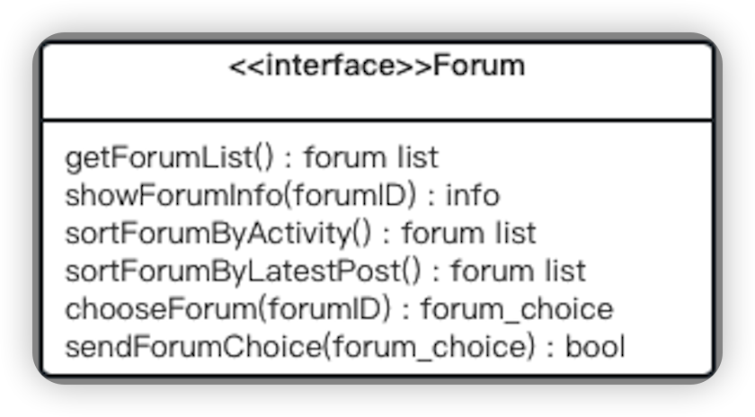

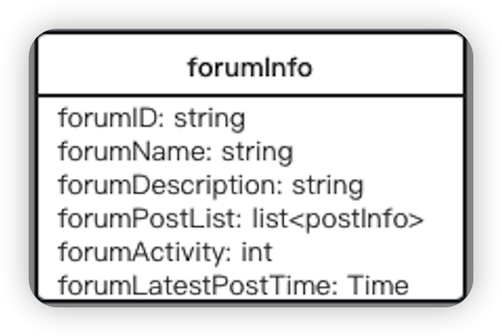

The methods used in this interface class are as follows: 

- getForumList(): forum list - Get the list of forums 
- showForumInfo(forumID): info - Get detailed information about a specific forum 
- sortForumByActivity(): forum list - Sort the forums by activity 
- sortForumByLatestColumn(): forum list - Sort the forums by the latest 
- post chooseForum(forumID): forum_choice - Choose a forum 
- sendForumChoice(forum_choice): bool - Send the chosen forum

The relationship table forumInfo stored in the database, which is used by this interface class, contains the following attributes: 

- forumID: string - Forum ID 
- forumName: string - Forum name 
- forumDescription: string - Forum description 
- forumColumnList: list<Column> - List of columns in the forum 
- forumActivity: int - Forum activity, e.g., number of posts or comments 
- forumLatestColumnTime: Time - Time of the latest post in the forum

Usage instructions for this interface class: This is the interface for forum operations in the forum subsystem, and it has six functions that can be called externally:

A. getForumList(): forum list - Get the list of forums This method returns the list of forums in the entire forum system.

B. showForumInfo(forumID): info - Get detailed information about a specific forum Based on the given forum ID, this method returns detailed information about the forum, such as the forum name, description, activity level, and the time of the latest post.

C. sortForumByActivity(): forum list - Sort the forums by activity This method returns the list of forums sorted by activity level (e.g., number of posts or comments).

D. sortForumByLatestColumn(): forum list - Sort the forums by the latest post This method returns the list of forums sorted by the time of the latest post.

E. chooseForum(forumID): forum_choice - Choose a forum Users can choose a forum by using this method, which returns the information of the chosen forum.

F. sendForumChoice(forum_choice): bool - Send the chosen forum After selecting a forum, users can send their selection using this method. It returns true if the selection is successfully sent, otherwise false.

When using this interface class, you can first retrieve the information of the entire forum using functions like getForumList, and then users can choose a specific forum using chooseForum and send their choice using sendForumChoice to perform subsequent operations within the subsystem, such as displaying detailed information about the selected forum.

#### 3.4.2. Interface Class: Column

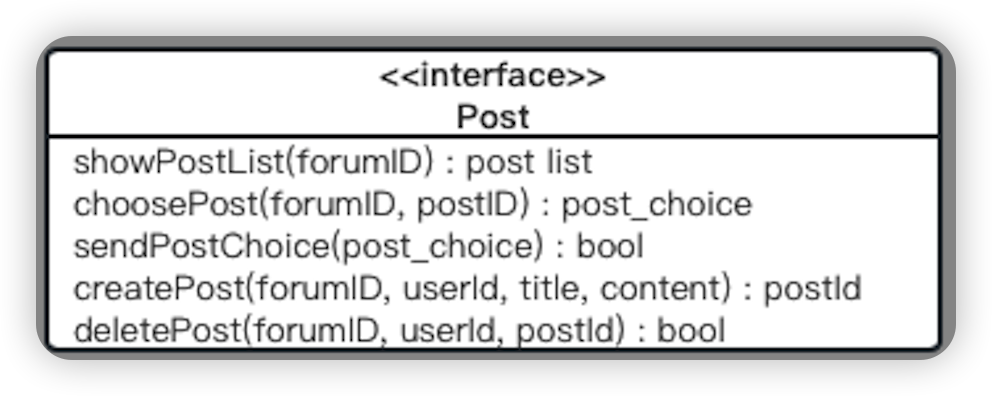

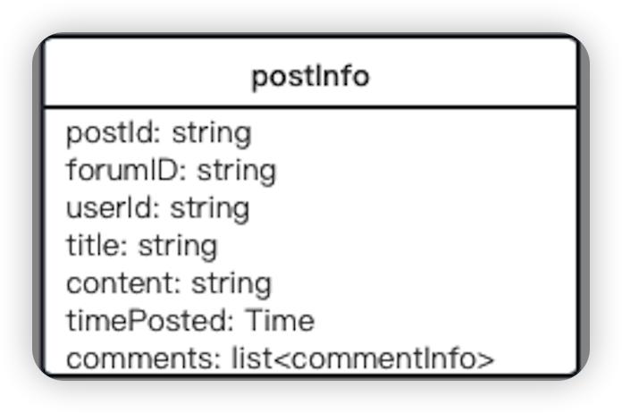

The methods used in this interface class are as follows: 

- showColumnList(forumID): column list - Get the list of posts within a 
- forum chooseColumn(forumID, columnID): column_choice - Choose a 
- post sendColumnChoice(column_choice): bool - Send the chosen post 
- createColumn(forumID, userID, title, content): ColumnID - Create a 
- new post deleteColumn(forumID, userID, columnID): bool - Delete a post

The relationship table columnInfo stored in the database, which is used by this interface class, contains the following attributes: 

- columnID: string - Post ID 
- forumID: string - Forum ID of the post 
- userID: string - User ID of the post creator 
- title: string - Post title 
- content: string - Post content 
- timeColumned: Time - Time of posting 
- comments: list<Comment> - List of comments on the post

Usage instructions for this interface class: This is the interface for post operations in the forum subsystem, and it has five functions that can be called externally:

A. showColumnList(forumID): column list - Get the list of posts within a forum This method returns the list of posts within a specific forum based on the given forum ID.

B. chooseColumn(forumID, columnID): column_choice - Choose a post Users can choose a specific post within a forum using this method, which returns the information of the chosen post.

C. sendColumnChoice(column_choice): bool - Send the chosen post After selecting a post, users can send their choice using this method. It returns true if the selection is successfully sent, otherwise false.

D. createColumn(forumID, userID, title, content): columnID - Create a new post Users can create a new post within a specified forum using this method. They need to provide the user ID, post title, and post content. If the creation is successful, it returns the ID of the new post.

E. deleteColumn(forumID, userID, columnID): bool - Delete a post Users can delete a post they have created using this method. It returns true if the deletion is successful, otherwise false.

When using this interface class, you can first retrieve the post information of a specific forum using functions like showColumnList. Users can choose a specific post using chooseColumn and send their choice using sendColumnChoice to perform subsequent operations within the subsystem, such as displaying detailed information about the selected post or the comment list. Users can also create and delete posts using createColumn and deleteColumn, respectively.

#### 3.4.3. Interface Class: Comment

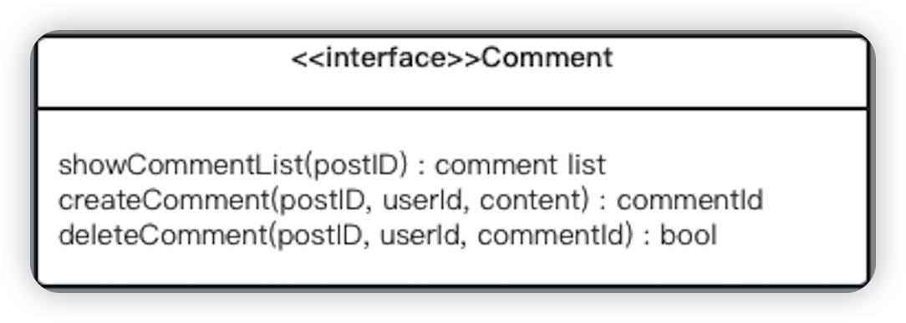

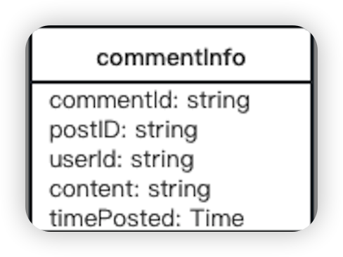

The methods used in this interface class are as follows: 

- showCommentList(columnID): comment list - Get the list of comments under a post 
- createComment(columnID, userID, content): commentID - Create a new comment 
- deleteComment(columnID, userID, commentID): bool - Delete a comment

The attributes of the commentInfo relationship table stored in the database, which is used by this interface class, are as follows: 

- commentID: string - Comment ID 
- columnID: string - ID of the post to which the comment belongs 
- userID: string - User ID of the comment creator 
- content: string - Comment content 
- timeColumned: Time - Time of commenting

Usage instructions for this interface class: This is the interface for comment operations in the forum subsystem, and it has three functions that can be called externally:

A. showCommentList(columnID): comment list - Get the list of comments under a post Based on the given post ID, this method returns the list of comments under that post.

B. createComment(columnID, userID, content): commentID - Create a new comment Users can create a new comment under a specific post using this method. They need to provide the user ID and comment content. If the creation is successful, it returns the ID of the new comment.

C. deleteComment(columnID, userID, commentID): bool - Delete a comment Users can delete a comment they have posted using this method. It returns true if the deletion is successful, otherwise false.

When using this interface class, you can first retrieve the comment list of a specific post using the showCommentList function. Users can create new comments using createComment, and when necessary, they can also delete their own comments using deleteComment. This interface class supports the interactivity and user participation in the forum subsystem.

## 4. Design Models

### 4.1 Login & Register System

#### 4.1.1 Design Model

The design model below shows the process when the user logs in. In the login page, the user can enter the relevant information and click login, the system will check whether the password is correct, so that the user interface jump or prompt the password error. The registration page requires the user to create an account. The system will check whether the account already exists. If it does not exist, a new account will be created for the user and saved in the database.

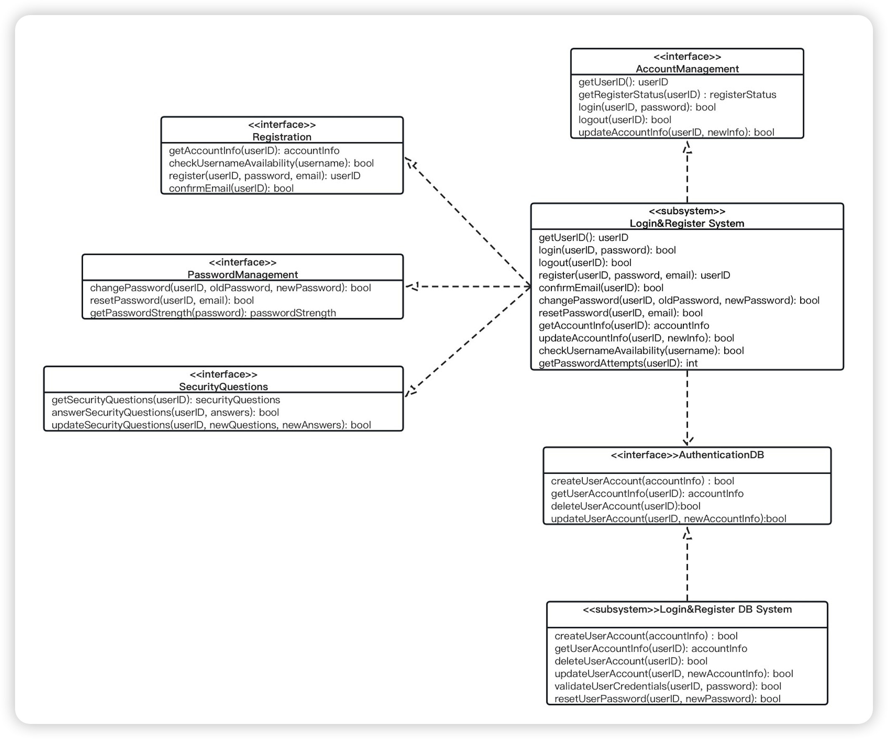

#### 4.1.2 Sequence Diagram

The following sequence diagram illustrates the system's processing flow during user login. On the login page, users can enter relevant information and click on "Login." The system will check if the password is correct, leading to either a page transition for the user or an error message indicating an incorrect password. On the registration page, users are required to create an account. The system will check if the account already exists. If it does not exist, a new account will be created for the user and saved in the database.

### 4.2 Forum System

#### 4.2.1 Design Model

The following design model shows the system process as the user navigates the forum home page. The user can click on the page to display the detailed content, and the system takes out the relevant content from the database for display. Users can click on the next page, the previous page to read the contents of the home page, the system will determine whether there is still the next page or the previous page, so as to choose to display the content of this page or prompt the user that the page does not exist.

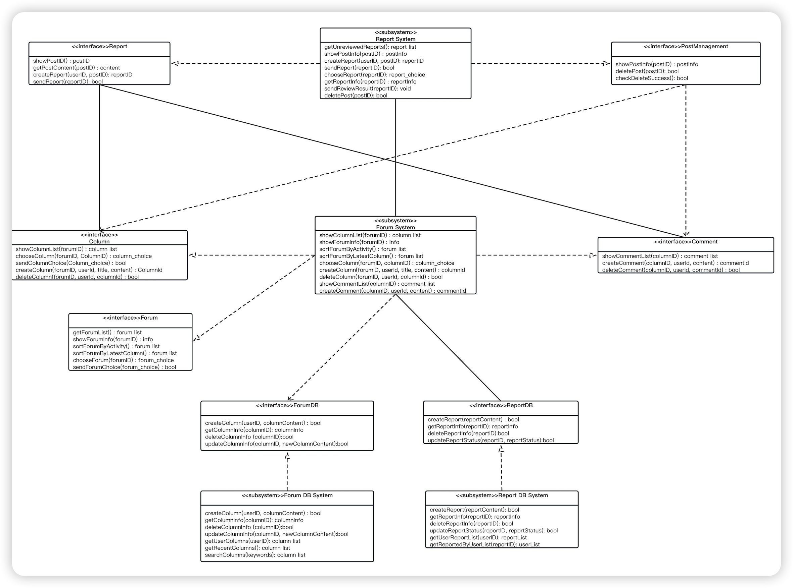

#### 4.2.2 Sequence Diagram

The following sequence diagram illustrates the system's processing flow when a user browses the forum's homepage. Users can click on a page to view detailed content, and the system retrieves the relevant content from the database for display. Users can navigate through the available content on the homepage by clicking on the "Next Page" or "Previous Page" buttons. The system will determine if there is a next or previous page and either display the content of that page or notify the user that the page does not exist.

The following sequence diagram illustrates the interaction process between a user and the system when browsing the comment section of a forum. Users can add comments, reply to comments, delete comments, or like comments. The system will assess the user's permissions and provide feedback accordingly. It will also make modifications to the database as necessary.

### 4.3 Garden Update System

#### 4.3.1 Design Model

The following design model shows a situation where a user requests to modify the garden. After the user clicks on the application, the application is submitted to the back-end for review. If the audit is passed, the system prompts that the modification is successful and shows the specific information of the garden before and after the modification to the user, and shows the modified place in detail. If the audit fails, the user application fails to be promoted.

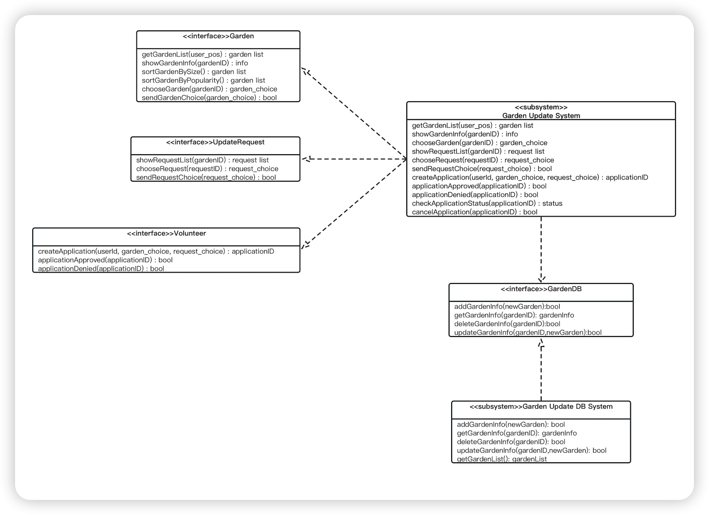

#### 4.3.2 Interaction Diagram

The following sequence diagram illustrates the scenario where a user requests to modify a garden. When the user clicks on the "Apply" button, the modification request is submitted for backend review. If the review is approved, the system notifies the user of the successful modification and displays the specific details of the garden before and after the modification. It also provides a detailed display of the modified areas. If the review is not approved, the system informs the user that their application has been rejected.

The following sequence diagram illustrates the scenario where a system administrator reviews user requests. The administrator can first click on "View Details," and the system will display the specific details of the garden before and after the modification, including the modified areas. If the administrator clicks on "Approve," the system will mark the request as approved. If the administrator clicks on "Reject," the system will mark the request as rejected.

The following sequence diagram illustrates the system processing flow for a user applying to become a volunteer. The user can first click on "Fill in the relevant information," and the system will store this information in the database. Then, the user can click on the "Join as Volunteer" button to submit an application to the administrator. If the application is approved, the user will receive a system notification indicating the successful application and detailed feedback. If the application is not approved, the user will receive a system notification indicating the unsuccessful application and providing specific reasons.

The following sequence diagram illustrates how an administrator reviews a user's volunteer application. The administrator can click on "View Application Details" to see the detailed information of the application and choose to either accept or reject it.

### 4.4 Garden View System

#### 4.4.1 Design Model

This design model shows how a user can view the garden details. The user can click on the garden of interest and the system will return the details of that garden. Users can like, rate and leave comments in the interface, and the system records these actions. The comments will be reviewed by the back-end, if the user can see the posted comments, if the user does not pass the message will also be alerted.

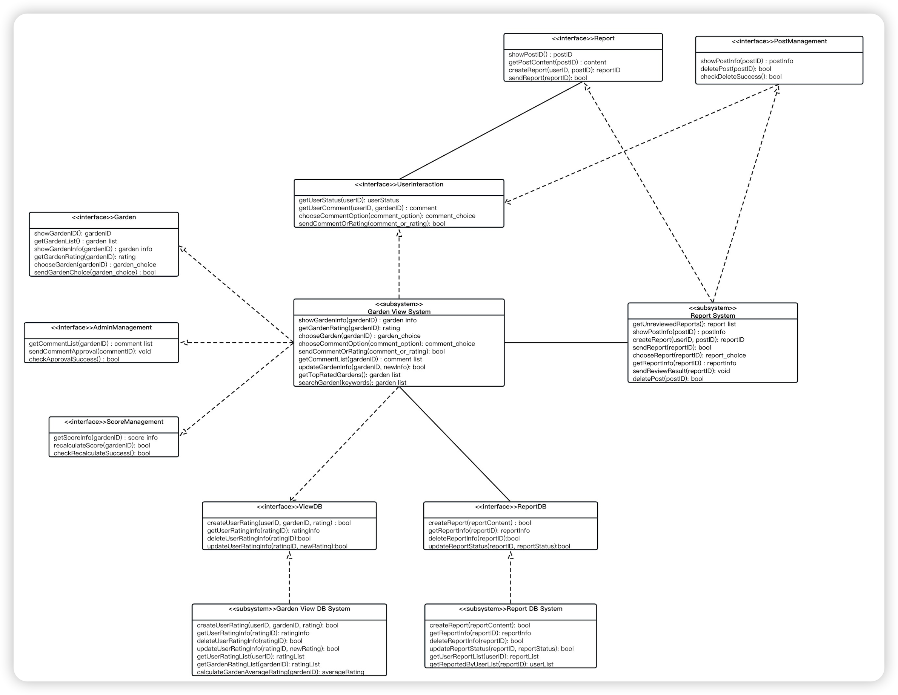

#### 4.4.2 Interaction Diagram

The following sequence diagram illustrates how a user can view detailed information about a garden. The user can click on a garden of interest, and the system will retrieve and display specific details about that garden. The user can interact with the interface by liking, rating, and leaving comments. The system will record these actions. Comments will undergo backend review, and if approved, the user can see the published comments. If not approved, the user will receive a notification.

### 4.5 Report System

#### 4.5.1 Design Model

This design model shows how users report bad content. When the user clicks the report button, the system will send the relevant content to the back-end for review, and the audit result will be returned to the interface to prompt the user after the review. Users can also choose to cancel the report.

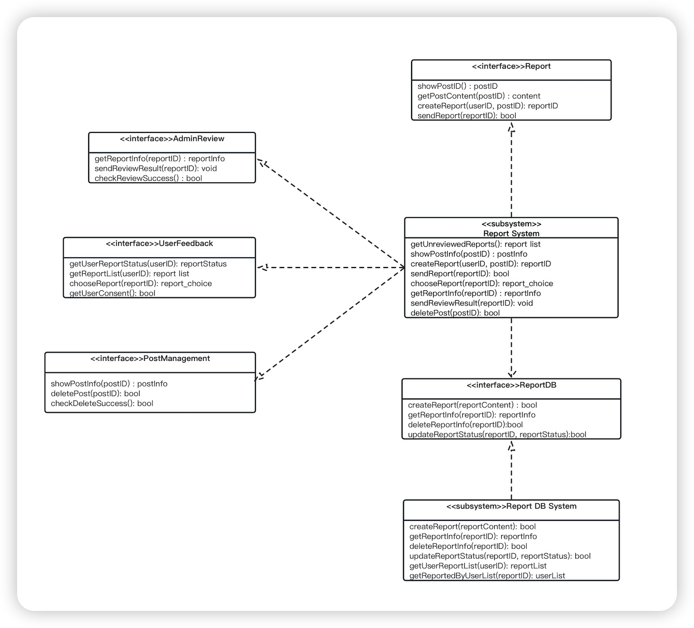

#### 4.5.2 Interaction Diagram

The following sequence diagram illustrates the process of a user reporting inappropriate content. The user clicks on the "Report" button, and the system sends the relevant content to undergo backend review. Once the review is complete, the system provides a notification on the interface to inform the user of the review outcome. The user also has the option to cancel the report.

The following sequence diagram illustrates the process of an administrator reviewing reported content. The administrator can view the detailed information of the report and choose to either approve or reject the report.

Additionally, the system supports the administrator's ability to directly delete content. The administrator can click on the delete button to remove inappropriate content directly, and they also have the option to cancel the deletion operation.

## 5. Critical Design Decisions

1. Platform Selection: We used a thorough evaluation process to select the most suitable platform that aligns with our system requirements. After careful consideration, we chose VSCode with related extensions to support our development and deployment needs. This platform offers robust compatibility with our target operating system, programming language, and cloud service provider, allowing us to achieve scalability, performance, and availability objectives.
2. Data Storage Solution: To meet our data storage requirements, we implemented a comprehensive evaluation of different options. After careful consideration, we decided to use the Oracle Database Management System. This choice allows us to store and manage our data efficiently, ensuring scalability, data consistency, and query performance as required by our system.
3. Security Strategy: We prioritized the security of our system and user data by implementing a robust security strategy. To achieve this, we adopted the OAuth 2.0 security framework. This framework provides a comprehensive set of authentication mechanisms, access control policies, data encryption methods, and vulnerability management procedures. By implementing this strategy, we ensure the confidentiality, integrity, and availability of our system.
4. Scalability Design: In anticipation of future scalability requirements, we employed a scalable design approach. By leveraging the Kubernetes architecture pattern, we designed our system to handle increasing user loads and data volumes. This approach enables horizontal scaling, distributed computing, load balancing, and caching strategies, ensuring the scalability and responsiveness of our system.
5. Performance Optimization: To optimize system performance, we conducted thorough performance analysis and implemented performance optimization techniques. Leveraging the Redis profiling tools and optimization strategies, we optimized critical areas such as algorithms, database queries, network communication, and resource utilization. This allowed us to achieve improved response time, throughput, and resource efficiency.
6. User Interface Design: We prioritized an exceptional user experience by focusing on intuitive and visually appealing user interfaces. Leveraging Vue3 framework , we created user interfaces that align with user workflows, responsiveness, accessibility, and visual aesthetics. This approach maximizes user satisfaction, ease of use, and adoption of our system.
7. Documentation: We recognized the importance of clear documentation and training materials for effective system understanding and usage. We developed comprehensive system documentation, including architecture diagrams, API documentation, and user guides.

## 6. Architectural Styles

In the Sharing Garden project, we adopted the microservices architecture style to build the entire system. Microservices architecture is a service-oriented architectural style that breaks down a large application into a set of smaller, autonomous services that collaborate to fulfill business requirements.

Microservices architecture offers the following advantages:

- Resilience and scalability: Microservices architecture allows independent scaling of each service based on demand, rather than scaling the entire system. This makes the system more resilient and able to handle high loads and traffic spikes, while also facilitating horizontal scaling.
- Independent development and deployment: Each microservice is autonomous and can be developed, tested, and deployed by independent teams. This decoupled nature improves development efficiency and enables teams to iterate and release services independently, without requiring system-wide downtime.

- Technological diversity: Microservices architecture encourages the use of different technology stacks and programming languages for building individual services, allowing teams to choose the most suitable technologies for their needs. This flexibility enhances the creativity and productivity of development teams.
- High availability and fault tolerance: By splitting the system into multiple services, microservices architecture ensures that the failure of a single service does not impact the availability of the entire system. Additionally, clear interfaces between services make it easier to implement fault tolerance mechanisms such as timeouts and failovers.

Microservices architecture is particularly suitable for complex applications, especially in the following scenarios:

- Projects that require rapid iteration and release of new features.
- Systems that need to support multiple platforms and devices.
- Environments that require scalability and adaptability to changing business needs.
- Projects that aim to improve team independence and collaboration efficiency.

Microservices architecture exhibits the following key characteristics:

- Single responsibility: Each microservice focuses on solving a specific business problem and has its own independent responsibilities.
- Loose coupling: Microservices communicate with each other through well-defined interfaces, maintaining relative independence.
- Distributed data management: Each service can have its own data storage, choosing a database or storage solution that suits its needs.
- Infrastructure automation: Microservices architecture relies on automated deployment, monitoring, and scaling to better handle system complexity.

In the Sharing Garden project, we divided the system into multiple microservices, such as user management, resource sharing, and permission control. Each microservice is developed and deployed independently, with clear API interfaces for communication between them. We utilize containerization technology (e.g., Docker) for deploying and managing microservices and container orchestration tools (e.g., Kubernetes) for coordinating and scaling service runtime. Through this approach, we achieve system resilience, scalability, and the benefits of independent development and deployment, effectively meeting the requirements of the Sharing Garden project.

## 7. List of References

This section lists the references and sources consulted to complete this document, most of which are from open-source communities such as internet blogs, forums, etc. These sources are provided by the author without copyright restrictions and can be used for further information and guidance.

- Smith, J. (2019). "Introduction to Software Architecture." Medium. [Online]. Available: https://medium.com/@johndoe/introduction-to-software-architecture-123456789. 
- Zhang, L. (2021). "UML Class Diagrams: A Comprehensive Guide." Towards Data Science. [Online]. Available: https://towardsdatascience.com/uml-class-diagrams-a-comprehensive-guide-f27f5923c2c8. 
- W3Schools. "UML Tutorial." [Online]. Available: https://www.w3schools.in/uml-tutorial/. 
- Tutorialspoint. "Software Architecture and Design." [Online]. Available: https://www.tutorialspoint.com/software_architecture_design/index.htm. 

- https://design-patterns.readthedocs.io/zh_CN/latest/read_uml.html

- 30 Minutes to Learn UML Class Diagram - Article by Xiao Jichao - Zhihu https://zhuanlan.zhihu.com/p/109655171

- 15 Commonly Used Design Patterns, Recommended for Bookmarking - Article by Ciki - Zhihu https://zhuanlan.zhihu.com/p/497208231

- Come on Baby! You Can Become a Web Development Engineer Too! - The Complete Guide to Becoming a Web Development Engineer - Article by Yu Bolun - Zhihu https://zhuanlan.zhihu.com/p/22978846

- One Article to Understand What Architecture Patterns and Architectural Styles Are - Article by Programmer Guli Ji - Zhihu https://zhuanlan.zhihu.com/p/96180863

- A Quick Understanding of Five Major Architectural Styles in One Diagram - Article by Wanmao Study Society - Zhihu https://zhuanlan.zhihu.com/p/429046857

## 8.Contributions

This project is the result of multiple discussions, revisions, additions, and refinements by two team members. Both members actively participated in the project and took on tasks in each section. We collaborated effectively and contributed to the quality and completeness of the project. The division of labor within the group was average and clear, as follows:

|Student Number|Name|Score Weight|
|---|---|---|
|2050633|Jialin Lu|100%|
|2053711|Jie Chu|100%|